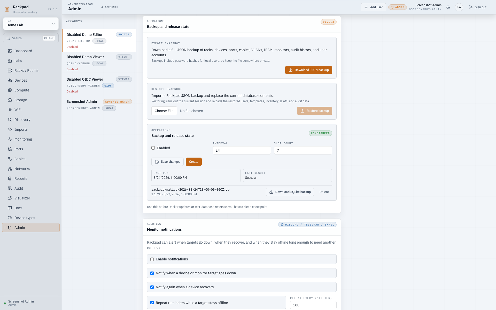

# Rackpad Installation Guide

Current stable release: `v1.8.3`
Use [GitHub Releases](https://github.com/Kobii-git/rackpad/releases) to confirm
the immutable tag and published artifacts before installation.

Rackpad is easiest to run from Docker. You can either pull the published image
without cloning the repo, or clone the repo and build it yourself.

## Which Install Should I Use?

- **Linux server or VM:** Use Docker and pull the published image.
- **Proxmox:** Use the documented Docker-in-LXC path. A first-party native LXC
  candidate is intended for disposable testing, and remains pre-release until its
  real-guest, update/rollback, soak, and stable gates pass.
- **Windows:** Use Docker Desktop with the published image.
- **Development/source build:** Clone `main` and build locally.

## Main Branch Or Version Tag?

- `main` is the stable source branch and is fine for cloning the latest stable code.
- `RACKPAD_TAG=1.8.3` pins the Docker image to a known release. Git tags use
  the `v` prefix, but Docker image tags do not.
- `RACKPAD_TAG=latest` follows the newest published stable GHCR image and is
  convenient for quick installs or test labs.
- `beta` is for testing newer changes before they are promoted.
- For production-style installs, keep `RACKPAD_TAG` pinned and change it only when you intentionally update.

GHCR can show `unknown/unknown` entries beside the linux/amd64 and linux/arm64
images. Those entries are non-runnable SLSA provenance and SPDX SBOM
attestations, not additional Rackpad runtime architectures.

Manual examples below download stable manifests from `main`. For beta, download
from `beta`; for a pinned version, use its matching `v`-prefixed Git tag. Keep the
manifest and image version paired. The maintenance installer resolves `latest`
to `main`, `beta` to `beta`, `dev` to `dev`, and complete version tags to matching
Git tags; custom images use the stable manifest.

## Before upgrading to 1.8.3

- Back up the database/volume and configuration together. Retain the original
  `RACKPAD_SECRET_KEY`. Migration 50 needs a key to encrypt existing inline SNMP
  communities and aborts atomically if it is missing. A lost key requires secret
  re-entry; generating a replacement cannot recover old encrypted values.
- Replace hop-count proxy settings with controlled IPs/CIDRs.
- Configure a trusted OIDC administrator subject/group and verify local recovery
  access. Old OIDC sessions are revoked and roles are recalculated on next login;
  email-based rules require boolean `email_verified: true`.
- Traps default off. Enable them explicitly if needed and reconfigure
  historical source credential links. Never expose UDP 1162 by accident.
- Schema 51 adds stack members and nullable port assignments. Published migrations
  49 and 50 remain unchanged, with security conversion at 50. Existing ordinary
  switches stay ordinary; do not run older binaries on schema-51 data.
- Migrations are forward-only. Roll back using the old image **and** its paired
  pre-upgrade database/configuration snapshot, never an older image alone.

See the [security upgrade notes](docs/releases/v1.8.2-beta.4-test-notes.md) and
[1.8.3 release notes](docs/releases/v1.8.3.md).

### Maintenance installer preservation

The installer validates the selected canonical manifest before
changing deployment files. It preserves an existing `.env` byte-for-byte and
reuses the existing Compose project directory and `rackpad_data` volume. The
legacy generated manifest is recognized by its exact checksum; a protected
`compose.yml.backup.*` copy is retained before atomic replacement. Subsequent
installer-managed files are tracked by `compose.yml.installer.sha256`.

A customized manifest is never overwritten or started automatically: merge the
adjacent `compose.yml.proposed.*` environment entries while retaining your mounts,
ports, project name, and hardening. Unknown existing state without `.env` is
refused. Only a verified empty deployment gets a generated key. Restore existing
configuration and keys before retrying an upgrade. Do not post environment files
or rendered Compose configuration in support reports. Supplied keys are written
in single quotes and verified against Compose after inherited overrides are
cleared; mismatches abort before pull or replacement. Accepted leading/trailing
spaces and ` #` sequences are preserved exactly. Unsupported characters require
manual `.env` configuration; parser failures never print secret-bearing lines.

## Common Settings

Rackpad uses this environment file for Docker installs:

```bash
RACKPAD_IMAGE=ghcr.io/kobii-git/rackpad
RACKPAD_TAG=latest
RACKPAD_PORT=3000
MONITOR_INTERVAL_MS=300000
TRUST_PROXY=0
TRUSTED_HOSTS=
TRUSTED_ORIGINS=
```

Most users only change:

- `RACKPAD_PORT`: host port to expose, default `3000`.
- `RACKPAD_TAG`: release version to run, for example `1.8.3`, or `latest` for
  the newest stable GHCR image.
- `TRUST_PROXY`, `TRUSTED_HOSTS`, `TRUSTED_ORIGINS`: set these when using a reverse proxy.

Set and retain `RACKPAD_SECRET_KEY` before saving encrypted integration or SNMP
credentials. It is also required for inline SNMP communities. All supported
environment variables are listed in [`.env.example`](./.env.example) and reach
the process through each shipped Compose file. The normal Compose profiles do
not publish UDP 1162; add an explicit `1162:1162/udp` mapping only when external
SNMP traps must reach Rackpad, or use the privileged host-discovery profile.

Rackpad stores its SQLite database in the Docker volume `rackpad_data`.

### Native SQLite snapshots (optional)



The JSON backup in **Users → Backup and release state** remains the portable
backup format. Rackpad can additionally create native SQLite snapshots when the
operator mounts a dedicated directory and sets `RACKPAD_NATIVE_BACKUP_DIR` to
its path inside the container. For example, add this service volume:

```yaml
services:
  rackpad:
    volumes:
      - rackpad_data:/data
      - /srv/rackpad-native:/backups
```

Then set `RACKPAD_NATIVE_BACKUP_DIR=/backups`. Rackpad never creates or chooses
the host directory. An administrator can enable the schedule in the Users page;
the defaults are disabled, every 24 hours, with seven snapshots retained.
Create-now, list, download, and delete operations are restricted to admins and
to Rackpad-generated `rackpad-native-*.db` files in that directory.

Create the host directory for Rackpad's fixed non-root UID and restrict it
before mounting it:

```bash
sudo install -d -o 10001 -g 10001 -m 0700 /srv/rackpad-native
```

Rackpad creates snapshot files with mode `0600`.

Native snapshots contain all durable SQLite state, including infrastructure
inventory, embedded documentation and device images, password hashes, and
encrypted secret values. Protect the mounted directory like the live database:
restrict host access, encrypt storage where appropriate, and include it in the
same retention and disposal controls as other sensitive backups.

## Linux Install

### 1. Install Docker

Ubuntu/Debian with distribution packages (`docker-compose-v2` availability depends
on the OS release):

```bash
sudo apt-get update
sudo apt-get install -y ca-certificates curl git docker.io docker-compose-v2
sudo systemctl enable --now docker
```

If your distribution does not provide Compose v2, follow the official
[Docker Engine installation](https://docs.docker.com/engine/install/) and
[Compose plugin installation](https://docs.docker.com/compose/install/linux/).
`docker-compose-plugin` requires Docker’s package repository to be configured;
do not mix Docker CE and distribution Engine packages. Verify `docker compose version`.

Optional: allow your user to run Docker without `sudo`.

```bash
sudo usermod -aG docker "$USER"
newgrp docker
```

### 2A. Run Straight From Docker, No Git Clone

```bash
sudo mkdir -p /opt/rackpad
cd /opt/rackpad
sudo curl -fsSLo compose.yml https://raw.githubusercontent.com/Kobii-git/Rackpad/main/docker-compose.release.yml
```

Create `.env`:

```bash
sudo tee .env >/dev/null <<'EOF'
RACKPAD_IMAGE=ghcr.io/kobii-git/rackpad
RACKPAD_TAG=latest
RACKPAD_PORT=3000
MONITOR_INTERVAL_MS=300000
TRUST_PROXY=0
TRUSTED_HOSTS=
TRUSTED_ORIGINS=
EOF
```

Deploy:

```bash
sudo docker compose pull
sudo docker compose up -d
sudo docker compose ps
```

If this is a quick lab install and you want Rackpad to follow the newest stable
published image, set `RACKPAD_TAG=latest` in `.env` instead of a fixed version.

If subnet discovery returns no hosts or no MAC addresses in Docker, especially
inside a Proxmox LXC, use the host-network discovery compose variant:

```bash
cd /opt/rackpad
sudo curl -fsSLo compose.host-discovery.yml https://raw.githubusercontent.com/Kobii-git/Rackpad/main/docker-compose.host-discovery.yml
sudo docker compose -f compose.host-discovery.yml pull
sudo docker compose -f compose.host-discovery.yml up -d
```

For manual/Arcane-managed compose stacks, the service needs host networking,
`NET_RAW`, `NET_ADMIN`, and sometimes root inside the container. See
[`docs/DOCKER_DISCOVERY.md`](./docs/DOCKER_DISCOVERY.md).

Open:

```text
http://SERVER_IP:3000
```

### 2B. Clone The Repo And Build Locally

Use this if you want the source on the server or want to build the image locally.

```bash
cd /opt
sudo git clone https://github.com/Kobii-git/Rackpad.git rackpad
cd /opt/rackpad
sudo git pull --ff-only origin main
sudo cp .env.example .env
sudo docker compose up --build -d
```

To build an exact release instead of current `main`:

```bash
sudo git checkout v1.8.3
sudo docker compose up --build -d
```

## Proxmox Install

Docker inside an LXC remains the supported general path below. The non-Docker
helper and operator controls are documented in
[`docs/PROXMOX_NATIVE_LXC.md`](./docs/PROXMOX_NATIVE_LXC.md), including the exact
experimental beta.5 test procedure. It is not a supported production installer
until the staged validation and stable-release gates are complete.

Recommended layout:

- Debian 12 or Ubuntu 24.04 LXC
- 2 vCPU minimum
- 2 GB RAM minimum, 4 GB preferred
- 8 GB disk minimum, 16 GB preferred
- Static DHCP lease or fixed IP recommended

### 1. Create The LXC

Create a normal Debian/Ubuntu LXC in Proxmox.

### 2. Enable Nesting

From the Proxmox UI:

1. Select the container.
2. Open `Options`.
3. Open `Features`.
4. Enable `Nesting`.
5. Restart the container.

Or from the Proxmox host shell:

```bash
pct set <CTID> -features nesting=1,keyctl=1
pct reboot <CTID>
```

Replace `<CTID>` with your container ID.

### 3. Install Rackpad Inside The LXC

Enter the LXC shell, then use the Linux install flow.

Fast path:

```bash
apt-get update
apt-get install -y curl ca-certificates
curl -fsSL https://raw.githubusercontent.com/Kobii-git/Rackpad/main/scripts/install-docker.sh | bash
```

Manual path:

```bash
apt-get update
apt-get install -y ca-certificates curl docker.io docker-compose-v2
systemctl enable --now docker
mkdir -p /opt/rackpad
cd /opt/rackpad
curl -fsSLo compose.yml https://raw.githubusercontent.com/Kobii-git/Rackpad/main/docker-compose.release.yml
```

Then create `.env` and deploy exactly like the Linux no-clone install.

More detail: [docs/PROXMOX.md](./docs/PROXMOX.md)

## Windows Install

Docker Desktop is the recommended Windows path.

### 1. Install Docker Desktop

Install Docker Desktop for Windows and make sure it is using Linux containers.

### 2. Create The Rackpad Folder

Open PowerShell:

```powershell
New-Item -ItemType Directory -Force C:\Rackpad | Out-Null
Set-Location C:\Rackpad
Invoke-WebRequest `
  -Uri "https://raw.githubusercontent.com/Kobii-git/Rackpad/main/docker-compose.release.yml" `
  -OutFile "compose.yml"
```

### 3. Create `.env`

```powershell
@'
RACKPAD_IMAGE=ghcr.io/kobii-git/rackpad
RACKPAD_TAG=latest
RACKPAD_PORT=3000
MONITOR_INTERVAL_MS=300000
TRUST_PROXY=0
TRUSTED_HOSTS=
TRUSTED_ORIGINS=
'@ | Set-Content -Encoding ascii .env
```

### 4. Deploy

```powershell
docker compose pull
docker compose up -d
docker compose ps
```

Open:

```text
http://localhost:3000
```

For access from another machine on your LAN, use the Windows host IP and allow
TCP `3000` through Windows Firewall if needed.

### Windows Source Build

This is mainly for development. Use Node `22 LTS`.

```powershell
git clone https://github.com/Kobii-git/Rackpad.git C:\Rackpad-src
Set-Location C:\Rackpad-src
npm install
npm run build
$env:HOST="0.0.0.0"
$env:PORT="3000"
$env:DATABASE_PATH="$PWD\rackpad.db"
npm start
```

If `better-sqlite3` fails during `npm install`, install Visual Studio Build
Tools or use Docker Desktop instead.

## First Run

1. Open Rackpad in the browser.
2. Create the first admin account.
3. Choose empty setup or demo data.
4. Start adding racks, devices, VLANs, IPAM, monitoring, WiFi, and compute data.

## After Install: Common Workflows

### Import Hyper-V Inventory

Use this when you have a Hyper-V host and want Rackpad to stage VMs, vNICs,
VLANs, IPs, power state, guest OS, CPU, memory, and disk data before importing.

1. Open Rackpad -> `Imports` and click `Download collector`, or copy
   [scripts/collect-hyperv.ps1](./scripts/collect-hyperv.ps1) to the Hyper-V host.
2. Open PowerShell as Administrator on the Hyper-V host.
3. Run:

```powershell
powershell -ExecutionPolicy Bypass -File .\collect-hyperv.ps1 -OutputPath .\rackpad-hyperv-inventory.json -IncludeHostAdapters
```

4. Upload `rackpad-hyperv-inventory.json` in Rackpad -> `Imports`.
5. In the host panel, choose `Auto match or create` or select an existing
   Rackpad device to import the VMs under.
6. Edit any staged host or VM fields that Hyper-V could not report.
7. Select the categories to import, then click `Import selected`.

Full details: [docs/HYPERV_IMPORT.md](./docs/HYPERV_IMPORT.md)

### Import Proxmox Inventory

Use this when you have a Proxmox VE node and want Rackpad to stage QEMU VMs,
LXC containers, bridges, vNICs, VLANs, MACs, IPs, power state, CPU, memory, and
disk data before importing.

1. Open Rackpad -> `Imports` and click `Download` in the Proxmox card, or copy
   [scripts/collect-proxmox.sh](./scripts/collect-proxmox.sh) to the Proxmox node.
2. Run the collector on the Proxmox node:

```bash
chmod +x ./collect-proxmox.sh
sudo ./collect-proxmox.sh --output ./rackpad-proxmox-inventory.json
```

3. Upload `rackpad-proxmox-inventory.json` in Rackpad -> `Imports`.
4. In the host panel, choose `Auto match or create` or select an existing
   Rackpad device to import the workloads under.
5. Edit any staged host, VM, or container fields that Proxmox could not report.
6. Select the categories to import, then click `Import selected`.

Full details: [docs/PROXMOX_IMPORT.md](./docs/PROXMOX_IMPORT.md)

### Export Reports

Open Rackpad -> `Reports`.

Use:

- `Print / PDF` to open the browser print dialog and save a polished PDF.
- `Excel workbook` to download an Excel-compatible multi-sheet workbook.
- `Full CSV` or section CSV buttons for spreadsheet-friendly raw data.

Full details: [docs/REPORTS.md](./docs/REPORTS.md)

### View Rack And Cable Relationships

Open Rackpad -> `Visualizer`.

Use it to inspect rack-mounted gear, loose room equipment, linked ports, cable
paths, and connected device context. The visualizer is generated from existing
Rackpad inventory, so add devices, ports, and cables first.

Full details: [docs/VISUALIZER.md](./docs/VISUALIZER.md)

### Configure OIDC Login

Rackpad can keep local users enabled while also offering OIDC sign-in through an
IdP such as Authentik, Pocket ID, Authelia, or Keycloak.

Set the OIDC environment variables in `/opt/rackpad/.env`, restart the
container, then use the provider login button on the sign-in screen. For
Authentik, the issuer is usually the application/provider path, for example:

```bash
OIDC_ENABLED=1
OIDC_LABEL=Authentik
OIDC_ISSUER_URL=https://authentik.example.com/application/o/rackpad
OIDC_CLIENT_ID=<client-id>
OIDC_CLIENT_SECRET=<client-secret>
OIDC_REDIRECT_URI=https://rackpad.example.com/api/auth/oidc/callback
OIDC_DEFAULT_ROLE=viewer
OIDC_ADMIN_GROUPS=admin
```

If provider setup returns an HTTP 404, temporarily set `OIDC_DEBUG=1` and test
`OIDC_ISSUER_URL/.well-known/openid-configuration`.

Full details: [docs/OIDC.md](./docs/OIDC.md)

### Write Runbooks And Attach Images

Open Rackpad -> `Docs` for Markdown runbooks and notes. Open a device detail
page -> `Images` to attach room, rack, label, or cabling reference images.

Full details: [docs/DOCUMENTATION.md](./docs/DOCUMENTATION.md)

## Update Rackpad

Before updates, download a backup from:

```text
Users -> Backup and release state -> Download backup
```

The logical backup includes the schema version, users, and per-lab permission
grants. It deliberately excludes active sessions, so every user signs in again
after restore. For important installations, also snapshot the `rackpad_data`
volume before upgrading.

Docker update:

```bash
cd /opt/rackpad
sudo docker compose pull
sudo docker compose up -d
```

Windows Docker Desktop update:

```powershell
Set-Location C:\Rackpad
docker compose pull
docker compose up -d
```

To update to a newer pinned release, change `RACKPAD_TAG` in `.env`, then run
the same pull/up commands. To always pull the newest stable image, set
`RACKPAD_TAG=latest`.

Database migrations are forward-only. Do not run an older image against a
database that has already been upgraded. Rollback requires restoring the
pre-upgrade database/volume snapshot and then starting the matching older image;
an older Rackpad version rejects logical backups from a newer schema.

### Offline native restore

Stop Rackpad before restoring a native snapshot. With the backup directory
mounted as shown above, run the restore CLI in a one-off container:

```bash
cd /opt/rackpad
sudo docker compose stop rackpad
sudo docker compose run --rm --no-deps rackpad node dist-server/cli/restore-native-backup.js --source /backups/rackpad-native-YYYY-MM-DDTHH-MM-SS.db
sudo docker compose up -d rackpad
```

The command rejects symlinks, the active database itself, corrupt SQLite files,
and databases that do not match the current Rackpad schema. Restore an older
native snapshot with its matching Rackpad image first, then upgrade normally.
The CLI writes a timestamped `rackpad-pre-restore-*.db`
safety copy beside the active database, preserves permissions, and replaces the
database atomically on the same filesystem. Restart Rackpad manually afterward.
To roll back, stop Rackpad again and run the same command with the safety copy as
the source. Test this process with disposable data before relying on it. The
offline restore CLI is supported in the shipped Linux container; Windows
operators should use the Docker command above rather than native Node execution.

## Admin Password Recovery

If a local Rackpad user password is lost, reset it from inside the Docker
container. The command prompts twice and does not echo the password:

```bash
cd /opt/rackpad
sudo docker compose exec rackpad node dist-server/cli/reset-password.js --username admin
```

If you run the container without Compose:

```bash
sudo docker exec -it rackpad node dist-server/cli/reset-password.js --username admin
```

The command only works for local password accounts and invalidates active
sessions for that user. OIDC users must reset passwords in the identity
provider.

## Stop Or Remove

Stop but keep data:

```bash
docker compose down
```

Delete the app container and database volume:

```bash
docker compose down -v
```

Only use `down -v` if you are okay deleting Rackpad's stored data.

## Reverse Proxy And TLS

Keep Rackpad private, behind a VPN, or behind a TLS reverse proxy.

**Older v1.8.0:** `TRUST_PROXY=1` trusts one controlled proxy hop; `2` trusts two
(up to 10). Truthy aliases mean one hop. Restrict direct access to the app.

**Stable v1.8.3 (and 1.8.2 beta.4 onward):** use the explicit IPs/CIDRs of controlled proxies.
Numeric hop counts and truthy aliases disable trust with a startup warning.
Replace old values before upgrading. For example, if the final proxy really
connects from `172.18.0.2`:

```bash
TRUST_PROXY=172.18.0.2
TRUSTED_HOSTS=rackpad.example.com
TRUSTED_ORIGINS=https://rackpad.example.com
```

Use `TRUST_PROXY=0` when no proxy is trusted. Permit application-port traffic only
from controlled proxies and overwrite client-supplied forwarding headers at the
public edge. Do not substitute universal CIDRs for an explicit trust boundary.

Included examples:

- [deploy/Caddyfile.example](./deploy/Caddyfile.example)
- [deploy/nginx-rackpad.conf](./deploy/nginx-rackpad.conf)

Your final proxy hop should pass:

- `Host`
- `X-Forwarded-Host`
- `X-Forwarded-Proto`
- `X-Forwarded-For`

## Troubleshooting

### Direct URLs return JSON errors

If `/cables`, `/compute`, or `/ipam` returns JSON instead of the app, update to
a current release and restart the container.

### Check Container Status

Linux/Proxmox:

```bash
cd /opt/rackpad
sudo docker compose ps
sudo docker compose logs -f
```

Windows:

```powershell
Set-Location C:\Rackpad
docker compose ps
docker compose logs -f
```

### Port 3000 Is Not Reachable

Check the host firewall, Proxmox firewall, router/firewall rules, Windows
Firewall, or change `RACKPAD_PORT` in `.env`.

### Native Install Fails At `better-sqlite3`

Use Node `22`. On Linux, install build tools:

```bash
sudo apt-get install -y build-essential python3
npm install
```

On Windows, use Docker Desktop unless you are comfortable installing native
build tools.

## Native Node deploy

For manually managed deployments, install Node 22 and native build prerequisites,
run `npm ci`, `npm run build`, then `npm start`. Configure `HOST`, `PORT`,
`DATABASE_PATH`, and the existing encryption key through a protected environment
file. Create the data directory with ownership for the service user.

The root [rackpad.service](rackpad.service) is a generic systemd example to adapt
for a manual installation. The managed native Proxmox helper installs its own
version-aligned unit; do not replace it with this example.

## Release Channels

- `main`: stable source branch
- `beta`: pre-release testing branch
- `vX.Y.Z`: pinned releases

See [CHANGELOG.md](./CHANGELOG.md) for version history.
