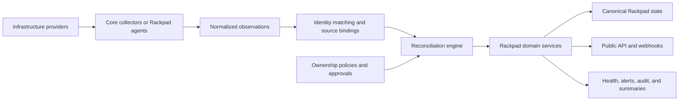

# Rackpad automation roadmap

- Status: proposed planning document
- Audience: maintainers, implementers, reviewers, and future connector authors
- Last reviewed: 2026-08-21

## Purpose

This document preserves the detailed product and engineering plan for evolving
Rackpad from an infrastructure inventory application into an infrastructure
source of truth and reconciliation control plane.

It is intentionally more detailed than the public GitHub roadmap. It records
the architecture, sequencing, safety boundaries, provider strategy, acceptance
criteria, and unresolved decisions that should guide implementation.

This document describes proposed work. It is not a claim that the described
features are already available, and it does not commit Rackpad to dates or
specific release numbers. Each phase should be split into small, independently
releasable changes.

## Current implementation baseline

The following are observed characteristics of the current Rackpad codebase and
documented behavior:

- Rackpad is a React, Fastify, and SQLite modular monolith running as one Node
  process and normally one hardened container.
- Rackpad Core owns the SQLite database and runs monitoring, discovery, SNMP,
  integration scheduling, alerting, and other background work in-process.
- Current first-class integration providers include Proxmox VE, UniFi Network,
  TP-Link Omada, OPNsense, and Dockhand.
- Manual integration pulls produce previews before applying changes.
- Scheduled integration sync is opt-in and intentionally non-destructive.
- The current provider contract is primarily based on connection testing,
  inventory collection, and optional scope discovery.
- Rackpad already models labs, rooms, racks, devices, ports, cables, VLANs,
  networks, IPAM, compute, Wi-Fi, storage, monitoring, discovery, services,
  documentation, reports, users, alerts, and backups.
- The existing HTTP API is primarily an internal SPA API authenticated with
  human Bearer sessions. It is not yet a stable, versioned public API.
- Integration secrets are encrypted at rest, but the current key model does not
  provide transparent key rotation.
- SQLite is appropriate for canonical inventory and operational state, but it
  should not become an unlimited time-series, flow-log, or packet database.

## Product direction

The target is not merely “more integrations.” The target is:

> If infrastructure information can be discovered, observed, reconciled,
> health-checked, or safely managed automatically, Rackpad should provide a
> controlled way to automate it.

Rackpad should become the platform that understands the whole environment even
when different systems own different parts of it.

Rackpad should primarily become a source-of-truth and reconciliation platform,
with controlled infrastructure-management capabilities. It should not attempt
to replace every provider controller, hypervisor interface, monitoring system,
configuration-management tool, or telemetry database.

## Architectural direction

Rackpad Core remains the control plane, canonical data owner, policy engine,
public API, and only writer to SQLite.

An optional `rackpad-agent` execution layer may perform collection and approved
actions near infrastructure that Core cannot or should not reach directly.

### Architectural rules

- Preserve the normal single-container deployment.
- Do not give an agent direct database access or mount the Rackpad data volume.
- Do not allow connectors to mutate domain tables directly.
- Route UI, API, import, and automation mutations through shared domain rules.
- Keep manual workflows available and allow manually pinned values.
- Treat integrations and their responses as untrusted input.
- Make automation opt-in and progressively permissioned.
- Separate collection, notification, and external actuation capabilities.
- Never enable write-back merely because a connection was added.
- Keep privileged discovery and host networking explicitly opt-in.
- Retain enough history to explain changes without turning SQLite into a
  telemetry warehouse.

## Core automation model

### Automation concepts

The implementation should define stable meanings for:

- **Source:** a configured provider instance, such as one Proxmox cluster.
- **Connector:** code that knows how to communicate with a provider or protocol.
- **Capability:** a declared collection or action surface supported by a
  connector.
- **Agent:** an authenticated execution runtime assigned to selected labs or
  sites.
- **Observation:** provider-reported state collected at a specific time.
- **Binding:** a relationship between a provider object and a Rackpad object.
- **Provenance:** the source, confidence, and ownership of an automated value.
- **Reconciliation:** comparison of observed, desired, and canonical state.
- **Conflict:** incompatible claims that cannot be resolved safely by policy.
- **Job:** durable scheduled or on-demand work.
- **Event:** a structured record of an infrastructure or automation change.
- **Change plan:** a previewable, approvable set of external actions.

### Desired, observed, and effective state

Managed fields should be able to represent:

- **Desired state:** what Rackpad says should exist.
- **Observed state:** what a provider currently reports.
- **Effective state:** the value Rackpad currently presents and uses.

Example:

| Field | Desired | Observed | Result |
| --- | --- | --- | --- |
| Port VLAN | 40 | 30 | Drift |
| VM memory | 16 GiB | 16 GiB | Compliant |
| DNS address | `10.0.1.20` | `10.0.1.21` | Conflict |
| Cable endpoint | Switch 1/12 | No link | Possibly unplugged |

### Reconciliation modes

Every source, capability, object class, or managed field group should have an
explicit mode:

1. **Observe** — collect and display only.
2. **Assisted** — suggest matches and changes for review.
3. **Safe sync** — automatically apply non-destructive Rackpad updates.
4. **Managed** — continuously reconcile selected fields under policy.
5. **Authoritative mirror** — allow a designated source to own a defined object
   class after provenance and deletion safety are proven.

Mirror behavior must not be implemented until source ownership and successful
complete-snapshot semantics make deletion safe.

## Identity and source ownership

Reliable identity is foundational. Incorrectly merging two assets or creating
duplicates will undermine every later automation feature.

### Identity signals

Rackpad should correlate provider objects using signals such as:

- Provider object ID and source instance
- Serial number
- System, BIOS, cluster, and VM UUID
- BMC identifier
- MAC address
- WWN
- Cloud resource ID
- Controller-specific ID
- FQDN and hostname
- Current and historical IP addresses
- Previous names and aliases

### Matching confidence

- Exact provider ID in an existing binding: automatic.
- Exact stable serial or UUID: highly trusted.
- MAC plus matching context: trusted.
- Hostname plus address and provider context: suggested.
- Display name alone: never automatically merged.

Operators need tools to merge duplicates, split incorrect matches, rebind
sources, and retain historical aliases.

### Field ownership order

The proposed precedence is:

1. Pinned manual value
2. Designated authoritative integration
3. Managed integration
4. Supporting observation
5. Heuristic discovery

A single Rackpad device may use different authorities for different fields:

| Information | Likely authority |
| --- | --- |
| Serial, model, hardware sensors | Redfish or BMC |
| Rack and U position | Operator or DCIM |
| Host and guest inventory | Hypervisor |
| Physical port state | Network switch or controller |
| Current address usage | DHCP and neighbor observations |
| Intended address allocation | Rackpad IPAM |
| Authoritative name | DNS |
| Service health | Rackpad monitoring |

## Connector contract

Each connector should publish a versioned capability manifest declaring:

- Provider and connector version
- Supported provider versions
- Authentication methods
- Required permissions
- Whether an agent is required
- Collection capabilities
- Event capabilities
- Write capabilities
- Stable identifier scheme
- Snapshot completeness semantics
- Pagination behavior
- Rate limits and recommended intervals
- Data ownership recommendations
- Expected secret types
- TLS requirements
- Known limitations

Standard capabilities should include:

- Inventory
- Compute
- Network configuration
- Ports and aggregates
- VLANs and topology
- Wi-Fi
- Storage
- IPAM
- DHCP
- DNS
- Monitoring
- Health and telemetry summaries
- Events
- Configuration backup
- Actuation

Connectors should emit normalized observations rather than provider-specific
mutations. Provider-specific payloads may be retained only in bounded,
redacted diagnostic form when required.

## Automation coverage by Rackpad domain

| Domain | Automation target | Boundary |
| --- | --- | --- |
| Labs and sites | Map controller sites, datacenters, clusters, and locations | Do not infer security boundaries automatically |
| Rooms and racks | Import from DCIM, BMS, or facilities sources | Hypervisors cannot infer physical U placement |
| Devices | Adopt identity, model, serial, firmware, status, parent, and lifecycle | Low-confidence matches require review |
| Device types | Suggest and apply templates by vendor/model | Preserve customized ports and slots |
| Ports | Discover media, speed, MAC, link, VLAN, PoE, optics, and errors | Configuration is a separate actuation capability |
| Aggregates | Discover LACP, switch LAGs, bonds, and NIC teams | Preserve aggregate and member identities |
| Cables and topology | Observe LLDP, CDP, and controller neighbors | Observed links are not confirmed physical cables |
| VLANs and networks | Discover VLANs, gateways, membership, routes, and VRFs | Multiple sources may own different layers |
| IPAM | Reconcile intended allocation against observed use | IPAM owns intent, not ephemeral lease history |
| DHCP | Import scopes, pools, reservations, leases, and HA health | Leases remain separate from permanent assignments |
| DNS | Import zones, records, PTRs, and mismatches | Preserve the distinction between desired and actual records |
| Compute | Discover clusters, hosts, guests, NICs, disks, and virtual switches | Avoid retaining every ephemeral runtime event |
| Wi-Fi | Discover sites, APs, radios, SSIDs, clients, signal, and roaming | Apply retention limits to client telemetry |
| Storage | Discover enclosures, slots, disks, pools, health, and capacity | Only trust stable physical bay identifiers |
| Services | Discover DNS, DHCP, VPN, NTP, SNMP, HTTP, databases, and apps | Create suggestions before enabling monitoring |
| Monitoring | Enrol appropriate checks and relate failures to dependencies | Allow exclusions and maintenance policies |
| Discovery | Run scheduled scans from the correct agent | Privileged network access remains opt-in |
| Documentation | Generate observed-facts sections and runbook variables | Never overwrite human-authored content |
| Reports and visualizer | Generate current topology, health, change, and capacity views | Clearly label inferred and observed relationships |
| Users and OIDC | Map groups to roles and labs; consider SCIM later | Never grant administrator access by inference |
| Backups | Monitor age, size, success, and restore-test status | Restore remains a high-risk explicit action |
| Alerts and audit | Explain changes, impact, source, and suggested action | Never log secrets or sensitive raw payloads |

## Physical networking model

Rackpad should distinguish two truths:

- **Observed link:** LLDP, CDP, link state, or a controller currently indicates
  two connected endpoints.
- **Confirmed cable:** Rackpad records a physical cable with confirmed endpoints,
  type, color, length, labels, and patching information.

Automation may detect link changes, suggest cable endpoints, report moves, and
mark confirmed cables as possibly unplugged. It must not invent cable color,
length, patch-panel path, wall-jack identity, or rack position.

## IPAM, DHCP, and DNS ownership

The target ownership model is:

- Rackpad IPAM is canonical for intended allocation.
- DHCP providers are authoritative for live lease state.
- Authoritative DNS providers report actual zone and record state.
- Policies reconcile these systems without collapsing them into one table.

The expanded model should support:

- Address spaces
- VRFs and routing domains
- IPv6-capable foundations
- Intended assignments
- Observed address claims
- Live leases with bounded retention
- DHCP reservations
- DHCP HA source grouping
- DNS zones and records
- Forward and reverse record reconciliation
- Scope utilization and exhaustion forecasts
- Duplicate IP and MAC detection
- Stale address claims
- Provider-specific ownership

Missing leases or records should only be inferred after a successful, complete
collection. A connection failure must not release addresses or remove records.

## Public API direction

Rackpad should introduce a stable `/api/v1` rather than treating the internal
SPA API as a public contract.

The public API should provide:

- OpenAPI documentation
- Stable resource schemas
- Pagination, filtering, and sorting
- Consistent error responses
- ETags and conditional updates
- Idempotency keys
- Bulk-safe operations
- Deprecation and compatibility rules
- Full domain coverage
- Change feeds and signed webhooks

Machine access should use named service principals rather than human sessions.
Service principals need:

- Hashed API keys
- Optional expiry
- Rotation and revocation
- Last-used tracking
- Lab-scoped access
- Fine-grained read, write, automation, integration, and secret scopes
- Independent rate limits
- Complete audit attribution

Agent identities must remain separate from public API service principals and
human accounts.

## Secrets and connector security

The automation layer materially expands Rackpad's trust boundary. Required
controls include:

- Least-privilege provider accounts
- Separate read and write credentials where supported
- Encryption key identifiers and rotation support
- Credential expiry and certificate expiry tracking
- Permission diagnostics
- Emergency revocation
- No secret-return endpoints
- Redaction in errors, audit, fixtures, and support bundles
- DNS-pinned and policy-checked outbound HTTP/S
- Production TLS verification by default
- Connector egress and resource restrictions
- Dependency and vulnerability scanning
- Signed connector packages if dynamic connectors are introduced

Community connectors should not run unrestricted inside Rackpad Core or
automatically receive all stored credentials.

## Agent direction

### Linux agent

A container or system service may provide:

- SNMP and topology collection
- Network discovery
- Local monitoring
- Controller integrations
- Redfish
- Docker and host-local collection
- Store-and-forward events

### Windows agent

A Windows service may provide:

- Hyper-V and Failover Clustering
- Windows DHCP and DNS
- WMI and CIM
- PowerShell inventory
- Windows-local monitoring

### Agent requirements

- Outbound-initiated Core connection
- Unique certificate-based identity
- Explicit lab and site assignment
- Capability declaration
- Revocation
- Task-scoped credential delivery
- Bounded offline queue
- Proxy support
- Bandwidth and runtime limits
- Version compatibility checks
- Safe upgrade and rollback behavior
- No database access

## Provider strategy

Provider support should be delivered in waves. “Support everything” should mean
an extensible contract and published support levels, not an immediate promise of
feature parity across every vendor.

### Wave 1 — Existing providers and foundations

- Proxmox VE
- UniFi Network
- TP-Link Omada
- OPNsense
- Dockhand and Docker
- Microsoft Hyper-V
- VMware vSphere and ESXi
- Generic SNMPv3, LLDP, and CDP
- Generic Redfish

### Wave 2 — Major networking and firewalls

- Cisco IOS-XE, NX-OS, Meraki, ACI, and Catalyst Center
- Fortinet FortiGate and FortiManager
- Palo Alto PAN-OS and Panorama
- Juniper Junos and Mist
- Aruba Central and AOS-CX
- MikroTik RouterOS
- Arista EOS and CloudVision
- pfSense
- Sophos Firewall
- Check Point
- VyOS

### Wave 3 — Compute, storage, and DDI

- Nutanix Prism and AHV
- XCP-ng and Xen Orchestra
- OpenStack
- Kubernetes
- TrueNAS
- Synology
- QNAP
- Ceph
- Dell iDRAC
- HPE iLO
- Lenovo XClarity
- Supermicro BMC
- Windows DHCP and DNS
- ISC Kea
- Technitium
- PowerDNS
- Infoblox
- BlueCat
- NetBox
- phpIPAM

### Wave 4 — Cloud and facilities

- Microsoft Azure
- AWS
- Google Cloud
- UPS platforms
- PDUs
- Environmental sensors
- Building-management systems

### Support levels

- **First class:** maintained and tested by Rackpad.
- **Compatible:** standards-based and covered by conformance tests.
- **Community:** external connector with limited guarantees.
- **Experimental:** preview-only support.

### Connector definition of done

A connector is not considered supported until it includes:

- Supported-version matrix
- Least-privilege setup instructions
- Stable identity rules
- Capability manifest
- Pagination and rate-limit handling
- Retry and backoff
- Partial-response protection
- Sanitized replay fixtures
- Duplicate, rename, and replacement tests
- Secret-redaction tests
- Reconciliation tests
- Read/write classification
- Operator-visible health diagnostics

## Operations and policy layer

### Automation Centre

The operator interface should eventually include:

- Provider catalogue
- Sources and credentials
- Agent assignment
- Capability and permission discovery
- Baseline preview
- Adoption inbox
- Object matching
- Ownership matrix
- Conflict centre
- Reconciliation and job history
- Provider and agent health
- Automation recipes
- Maintenance windows
- Change plans and approvals
- Webhooks
- Emergency stops

### Initial recipes

- Adopt a newly discovered device
- Apply a device template based on vendor and model
- Create ports from switch or controller inventory
- Create monitoring checks for discovered services
- Correlate VM NIC, MAC, DHCP lease, DNS record, and IPAM assignment
- Detect unmanaged addresses
- Warn on DHCP capacity
- Detect VLAN drift
- Detect moved or unplugged links
- Detect duplicate identity
- Mark objects stale after a grace period
- Generate daily and weekly infrastructure summaries

Recipes should be declarative policies. Arbitrary user scripts should not run in
Rackpad Core.

### Dependency and impact graph

Rackpad should model relationships such as:

- Application to service
- Service to VM or container
- VM to hypervisor
- Hypervisor to physical ports
- Service to DNS record
- Service to firewall or NAT policy
- Device to UPS or PDU
- Site to WAN or VPN

This graph can support root-cause summaries and change blast-radius analysis.

### Compliance and lifecycle intelligence

Potential reporting includes:

- Management-network placement
- Redundant uplinks
- Monitoring coverage
- Unsafe legacy protocols
- VLAN policy
- Firmware age
- Warranty and end-of-support dates
- Backup health
- Credential expiry
- Capacity thresholds

Compliance should begin as reporting. Automated remediation belongs behind the
later change-plan and approval system.

## External actuation model

Collection, notification, and actuation are separate capabilities.

### Action risk levels

**Automatic internal actions** may include:

- Updating derived Rackpad relationships
- Updating health
- Creating alerts
- Enrolling approved monitoring targets
- Generating reports and summaries

**Policy-controlled external actions** may later include:

- Creating DHCP reservations
- Creating or updating DNS records
- Applying provider tags or metadata
- Updating approved descriptions

**Change-plan actions** initially require preview and approval:

- VLAN creation
- Port access or trunk configuration
- Hypervisor networking
- Firewall objects
- VPN configuration
- VM lifecycle operations
- Storage configuration

**High-risk actions** require explicit elevated approval:

- Firewall policy changes
- Routing changes
- Interface shutdown
- Firmware upgrades
- Destructive VM or storage operations
- Backup restoration
- Factory reset

Every external change should include:

- Before-state snapshot
- Proposed diff
- Dependency and blast-radius analysis
- Validation
- Maintenance-window check
- Approval or explicit policy identity
- Idempotency key
- Execution audit
- After-state verification
- Rollback information where the provider supports it

## Data volume and retention

Rackpad should retain:

- Latest observed state
- Important state transitions
- Bounded historical rollups
- Health incidents
- Reconciliation history
- Configuration drift
- Capacity trends

Rackpad should not retain indefinitely:

- Firewall sessions and flows
- Raw syslog
- Packet captures
- Every SNMP counter poll
- Every Wi-Fi signal sample
- Minute-by-minute lease history

Deeper telemetry should integrate with systems such as Prometheus, InfluxDB,
Loki, or a SIEM. Rackpad stores canonical inventory and operational conclusions.

## Delivery phases

The phases are dependency ordered. They are not release numbers, and work inside
a phase should ship incrementally behind compatible defaults or feature flags.

### Phase 0 — Architecture and contracts

Goal: confirm the Core/agent boundary, automation terminology, state model,
retention policy, API boundary, and security threat model.

Exit criteria:

- Architecture decisions are recorded.
- Current single-container behavior remains the default.
- Deletion, ownership, and approval semantics are unambiguous.
- Public and internal API responsibilities are separated.

### Phase 1 — Identity, provenance, and domain services

Goal: establish stable resource identity, source bindings, field provenance,
desired/observed state, and shared mutation services.

Exit criteria:

- Snapshot replay creates no duplicates.
- Renames preserve identity.
- Manual values cannot be overwritten unexpectedly.
- Bindings can be merged, split, and repaired.
- Backup and restore cover the new state.

### Phase 2 — Jobs, observations, and reconciliation

Goal: add normalized observations, durable jobs, events, conflicts, retention,
reconciliation modes, and circuit breakers.

Exit criteria:

- Jobs survive restart.
- Repeated delivery is idempotent.
- Partial or empty provider responses cannot mass-delete inventory.
- Every reconciliation is explainable and audited.

### Phase 3 — Public API and machine security

Goal: introduce `/api/v1`, service principals, scoped API keys, OpenAPI,
webhooks, change feeds, and secret-rotation foundations.

Exit criteria:

- External clients do not impersonate users.
- Lab and resource scopes are enforced server-side.
- API contracts are versioned and documented.
- Keys and webhooks can be rotated and revoked.

### Phase 4 — Optional agents

Goal: deliver Linux and Windows execution agents with outbound connectivity,
capability declaration, offline buffering, revocation, and safe credential use.

Exit criteria:

- Remote sites require no inbound Core connection.
- Agents cannot access unauthorized labs or credentials.
- Hyper-V and Windows infrastructure can be collected locally.
- Agent disconnection and version mismatch fail safely.

### Phase 5 — Converge current integrations

Goal: move Proxmox, UniFi, Omada, OPNsense, and Dockhand onto the normalized
connector and reconciliation contract. Use Hyper-V and Redfish as new reference
connectors.

Exit criteria:

- Existing behavior remains compatible.
- Every automated field shows its source.
- Current providers pass connector conformance tests.
- Empty and partial responses are safe.

### Phase 6 — Network, topology, and DDI autonomy

Goal: automate ports, aggregates, VLANs, observed topology, IPAM, live leases,
DHCP, DNS, VRFs, address claims, conflicts, and capacity warnings.

Exit criteria:

- Live leases are separate from permanent assignments.
- Multiple sources do not create duplicate leases or addresses.
- VRFs safely support overlapping address spaces.
- Observed links are distinct from confirmed cables.
- VLAN and IP drift is visible and actionable.

### Phase 7 — Major provider expansion

Goal: expand compute, networking, firewall, storage, DDI, cloud, and facilities
coverage using published support levels and connector conformance requirements.

Exit criteria:

- Provider quality and supported versions are visible.
- Shared standards are reused before vendor-specific duplication.
- Connector failures remain isolated.
- Unsupported versions fail with clear diagnostics.

### Phase 8 — Automation Centre and operations intelligence

Goal: add adoption, conflicts, ownership, lifecycle, maintenance, dependencies,
summaries, compliance reporting, configuration diffing, and impact analysis.

Exit criteria:

- Operators can explain every automated update.
- Conflicts have a clear resolution workflow.
- Alerts describe source, confidence, impact, and suggested action.
- Maintenance and lifecycle policies behave predictably.

### Phase 9 — Controlled write-back and ecosystem

Goal: introduce previewable external change plans, approvals, verification,
rollback information, community connector isolation, and integrations with
external automation and telemetry platforms.

Exit criteria:

- Adding an integration never enables write-back automatically.
- Read and write credentials can be separated.
- High-risk actions cannot bypass approval.
- External actions are idempotent, audited, and verified.
- Community extensions cannot compromise Rackpad Core by default.

## Cross-cutting implementation requirements

Every phase must cover the following areas.

### Security

- Least privilege
- Lab-scoped authorization
- Negative authorization tests
- Secret rotation and redaction
- SSRF and egress defenses
- Connector isolation
- Rate limiting
- Complete action attribution
- No default TLS weakening

### Data integrity

- Forward migrations
- Temporary-database migration tests
- Backup and restore coverage
- Stable identifiers
- Foreign-key integrity
- Duplicate prevention
- Partial-response protection
- Retention and purge behavior

### Compatibility and deployment

- Preserve existing manual workflows.
- Preserve the single-container installation.
- Make new automation opt-in.
- Document agent networking and privilege requirements.
- Reject incompatible agent or provider versions safely.
- Use feature flags or staged enablement for high-risk behavior.

### Testing

- Provider fixture replay
- Empty and partial response injection
- Duplicate event delivery
- Rename and replacement behavior
- Identity collision tests
- Reconciliation idempotency
- Authorization tests
- Circuit-breaker tests
- Agent disconnection tests
- Backup and restore tests
- Large inventory and database-growth tests
- Write-plan verification and rollback rehearsal

### Documentation

- Provider setup and supported versions
- Required permissions
- Automation modes and ownership
- Security implications
- Agent deployment
- API examples
- Troubleshooting
- Recovery and rollback limitations

## Configuration backup and compliance

For supported network, firewall, storage, and compute providers, Rackpad should
eventually support secret-redacted configuration snapshots and structural diffs.

Potential capabilities include:

- Scheduled configuration backup
- Last-known-good reference
- Unexpected-change alerts
- Comparison across similar devices
- Policy compliance checks
- Change attribution where providers expose it

Configuration restoration remains a separate high-risk action and must not be
implied by configuration backup support.

## Simulation and connector development

Before broad write-back, Rackpad should provide a safe way to test automation:

- Replay sanitized provider snapshots
- Simulate missing or empty responses
- Test identity rules
- Preview reconciliation
- Test policies against historical state
- Simulate agent disconnection
- Calculate change blast radius
- Exercise verification and rollback logic

A sanitized support bundle may include connector versions, health, schemas, and
redacted diagnostics, but never credentials, raw private data, databases, or
backups.

## Explicit non-goals

Rackpad should not:

- Replace every provider management interface.
- Become an unlimited time-series or log database.
- Store raw firewall flows or packet captures indefinitely.
- Guess physical rack placement or cable characteristics.
- Treat observed topology as confirmed cabling.
- Allow connectors or agents to write SQLite directly.
- Run arbitrary untrusted scripts in Core.
- Enable destructive actions automatically.
- Require agents for installations that do not need them.
- Abandon self-hosted simplicity without demonstrated need.

## Risks and mitigations

| Risk | Mitigation |
| --- | --- |
| Scope expands faster than maintainability | Capability contracts, phased delivery, and published support levels |
| Incorrect identity merges | Stable IDs, confidence scoring, review, and split/repair tools |
| Provider API drift | Version detection, fixtures, replay tests, and compatibility matrices |
| Mass changes after bad data | Complete-snapshot semantics, grace periods, and circuit breakers |
| Powerful credentials are exposed | Least privilege, encryption rotation, agent scoping, and redaction |
| SQLite grows without bound | Latest state, bounded history, retention, and external telemetry systems |
| Agent or connector compromises Core | Outbound identities, permission manifests, isolation, and no DB access |
| Automation obscures operator intent | Provenance, previews, conflicts, audit, and manual pins |
| Support burden becomes unsustainable | First-class/compatible/community/experimental support tiers |
| Rollback is impossible on a provider | Pre-state capture, verification, explicit limitations, and approval |

## Success measures

Candidate measures include:

- Percentage of inventory with trusted source bindings
- Percentage of automated fields with provenance
- Duplicate and incorrect-match rates
- Time from discovery to adoption
- Reconciliation success rate
- Provider and agent staleness
- Prevented unsafe mass-change events
- Time to identify integration failures
- IP conflict detection time
- DHCP capacity warning accuracy
- Monitoring coverage
- Database growth per managed resource
- External action verification rate

## Open product decisions

These decisions should be resolved before or during their dependent phases:

- Whether a dedicated GitHub Roadmap Discussion category should be created
- Which providers qualify for first-class support first
- Whether the first agent release supports Core-pull, agent-push, or both job
  initiation patterns while retaining outbound networking
- How encryption-key rotation is exposed operationally
- Which API key and agent credential formats become public contracts
- Whether VRFs ship before or with live DHCP lease support
- Which external actions are safe enough for the first write-back release
- Whether two-person approval is required for selected actions
- Whether community connectors are separate processes, containers, or signed
  packages
- Which external telemetry systems receive first-class integration
- Which automation history must be included in logical backups

## Recommended implementation discipline

- Deliver vertical slices instead of implementing every schema table first.
- Prove each contract by migrating an existing provider before expanding it.
- Introduce write paths only after observation and reconciliation have operated
  safely in real environments.
- Keep provider-specific behavior at connector boundaries.
- Reuse the same domain validation for UI, API, imports, and automation.
- Require a preview or dry-run for every new externally observable action.
- Add durable documentation only when behavior ships; keep proposed behavior in
  this roadmap until then.
- Review this roadmap at the start and end of each automation phase.
