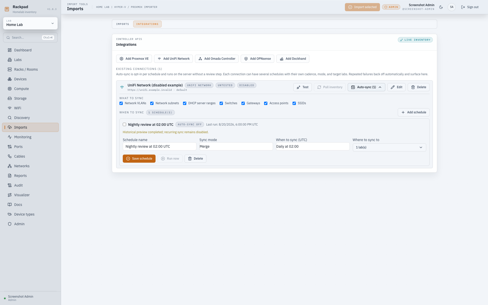

# Controller integrations

Rackpad can connect directly to Proxmox VE, UniFi Network, TP-Link Omada,
OPNsense, and Dockhand and pull live inventory over their HTTP APIs: devices,
VLANs, networks/subnets, DHCP ranges, and containers. Manual pulls stay
review-first: they produce a preview diff against the active lab and nothing is
written until an administrator applies it. Opt-in schedules write automatically
without a per-run review.

The panel lives on the **Integrations** tab of the Imports page (the
existing collector and Docker imports keep their own **Imports** tab).
Adding a connection is a three-step flow: enter the URL and credentials,
click **Test & discover** to prove them and list what the controller offers,
then tick the sites (UniFi/Omada), cluster nodes (Proxmox), or environments
(Dockhand) to pull from — leaving everything unticked uses the provider's
default. Each provider shows its own pull checkboxes (for example Proxmox
"SDN VLANs" versus Omada "LAN VLANs") with hover text explaining exactly
what each brings in; Proxmox SDN VLANs live on the host overlay fabric and
may not correspond to your physical switch VLANs, which is why they are
labeled and described separately. Pulling inventory opens a preview dialog
with one tab per object type (VLANs, subnets, DHCP, devices) so large
controllers stay reviewable.

## Requirements

- `RACKPAD_SECRET_KEY` must be set on the server before connections can be
  saved. Credentials are encrypted at rest with AES-256-GCM using the same
  key that protects SNMPv3 credentials (`openssl rand -hex 32` generates a
  good value). Rotating the key invalidates stored secrets — re-enter them
  after a change.
- The Rackpad server (or container) must be able to reach the controller on
  the LAN. Requests are DNS-pinned and refuse loopback, link-local, and other
  reserved destinations, the same policy as HTTP monitors.
- Self-signed controllers work: untick **Verify TLS certificate** on the
  connection. Prefer installing a trusted certificate where you can.

## Per-provider setup

### Proxmox VE

1. Create an API token: Datacenter → Permissions → API Tokens, e.g.
   `rackpad@pam!inventory` with **Privilege Separation** enabled.
2. Grant the backing user `rackpad@pam` read access at `/` with role
   `PVEAuditor` and propagation enabled. Then add an API Token Permission
   for `rackpad@pam!inventory` with the same path, role, and propagation.
   With Privilege Separation enabled, effective access is the intersection
   of the user and token permissions. A token cannot exceed its user’s rights.
   Missing permissions may yield empty VM lists; Rackpad warns when a pull sees no guests.
3. In Rackpad, add a Proxmox VE connection with the URL
   (`https://pve.example:8006`), the token ID (`rackpad@pam!inventory`), and
   the token secret.

- **Test** reports the version, cluster name, node list, and workload counts.
- **Pull inventory** previews bridge/VLAN-interface subnets and Proxmox SDN
  vnets/subnets (including SDN DHCP ranges) for IPAM, plus a read-only list
  of nodes, VMs, containers, and bridges — and the Import tab carries the
  whole stack from the host down: nodes as server devices, bridges as
  virtual switches on them, and QEMU/LXC guests as virtual devices under
  their node with NICs, MACs, VLAN tags, virtual switch links, and IPs
  (from the guest agent or container interfaces). Templates are skipped,
  and OVS setups work: bridges are derived from their member ports when
  the node does not list the OVSBridge rows themselves.
  The offline `collect-proxmox.sh` upload on the Imports tab remains for
  hosts Rackpad cannot reach.

### UniFi Network

Two auth options:

- **API key** (recommended, UniFi OS consoles / Network 9+): create a key
  under Settings → Control Plane → Integrations, and use the console URL
  (`https://unifi.example`). Networks/VLANs over this API need Network 10+;
  on 9.x Rackpad imports devices and tells you to use username/password for
  networks.
- **Username / password**: a local view-only admin works against both UniFi
  OS consoles and classic self-hosted controllers (`https://host:8443`).
  Rackpad detects the flavor automatically and only issues read-only calls.

Pulls map corporate/VLAN-only networks to VLANs and subnets, DHCP server
ranges to preview-only scopes, and list switches, APs, and gateways with
model, MAC, IP, state, and firmware. WAN and VPN networks are excluded from
IPAM. **Test & discover** lists the console's sites; tick one or more to
pull from (default: the first site).

### TP-Link Omada

1. Controller v5.15+ (software controller or OC300; the OC200 does not
   support the Open API).
2. Create an Open API client: Global View → Settings → Platform Integration →
   Open API → Add New App, mode **Client Credentials**, role **Viewer**.
3. Add the connection with the controller URL (`https://omada.example:8043`),
   the Client ID, and the Client Secret. The `omadacId` is discovered
   automatically.

Pulls map LAN networks/interfaces to VLANs and subnets, DHCP server ranges
to preview-only scopes, and list switches, gateways, and APs for every
selected site (**Test & discover** lists them; default: the first site).
If a controller build returns nothing from the per-site device endpoint,
Rackpad falls back to the controller-wide device list and says so in the
preview warnings.

### OPNsense

1. Create an API key: System → Access → Users → (user) → API keys. A
   dedicated user with only the relevant read privileges (or Viewer-style
   access) is recommended.
2. Add the connection with the firewall URL and the key/secret pair.

Pulls map VLAN definitions and interface IPv4 networks to VLANs and
subnets, and Kea DHCPv4 pools plus Dnsmasq ranges to preview-only scopes.
When the firewall reports a VLAN id for a subnet Rackpad already tracks
without a VLAN link, the preview offers the association and merge applies
it — existing subnets get connected to their VLANs instead of staying
orphaned. Legacy ISC
dhcpd does not expose its ranges over the API — Rackpad warns instead of
silently omitting them. Both pre- and post-25.7 API URL casings are handled.

### Dockhand

1. Dockhand v1.0.25+ with authentication enabled. Generate an API token on
   your profile page (Profile → API tokens → Generate API token; local users
   re-enter their password).
2. Add the connection with the Dockhand URL (`http://dockhand.example:3000`
   by default — Dockhand usually sits behind a reverse proxy if you use
   HTTPS) and the `dh_...` token as the API key.
3. **Test & discover** lists the Docker environments; tick the ones to
   pull from (default: all of them).

Pulls list each Docker environment as a host (online state, running/total
containers, stacks), every container (image, IP, state/health, compose
stack), and Docker networks with their drivers and subnets. Container
plumbing is deliberately kept out of IPAM — Docker networks appear as
read-only previews only. Offline environments are skipped with a warning
rather than reported as empty. On the free edition any valid token has admin
scope, so treat Dockhand tokens with the same care as the other credentials.

## Mixed environments (Omada/UniFi + OPNsense)

When VLANs live on the switching controller but networks terminate at the
firewall, use the per-connection pull toggles so each source owns what it
terminates:

- Switch controller connection: keep the VLAN checkbox on, subnets/DHCP off.
- OPNsense connection: keep subnets and DHCP on, VLANs off.

The preview reconciles both sources against IPAM by VLAN id and CIDR, so the
same VLAN or subnet reported by two controllers never creates duplicates, and
skipped record kinds are called out in the preview warnings.

## What runs automatically vs. manually

- **Automatic (background):** connection status. Every
  `INTEGRATION_STATUS_SYNC_INTERVAL_MS` (default 5 minutes, `0` disables)
  Rackpad re-runs each enabled connection's lightweight test call and updates
  the status badge, product/version summary, and last error on the
  Integrations panel. Disabled connections are skipped. Docker/Portainer
  container *status* refresh has its own loop
  (`DOCKER_STATUS_SYNC_INTERVAL_MS`).
- **Automatic (opt-in): scheduled inventory sync.** See below.
- **Manual (default):** inventory. Pulling VLANs, subnets, DHCP ranges, and
  device previews — and applying them to IPAM — is a human action behind the
  review diff unless an administrator explicitly schedules a connection.

## Scheduled auto-sync (opt-in)

Each connection carries its own **Auto-sync** section (expand it with the
Auto-sync button on the connection row), structured as what to sync → when
to sync → where to sync to: the connection's pull toggles (editable inline),
its schedules, and each schedule's target-labs multi-select. Auto-sync is
off by default and only administrators can configure it, because scheduled
runs write without a per-run review.

- **Multiple schedules per connection:** each connection can have any number
  of named schedules, each with its own cadence, mode, and target labs — for
  example a nightly merge into a production lab plus an hourly skip-mode sync
  into a staging lab, both fed by the same controller.
- **Schedule:** pick a basic preset (every 15/30 minutes, hourly, every
  6 hours, daily, weekly) or switch to **Custom cron (advanced)** for a
  five-field cron expression (`minute hour day-of-month month day-of-week`).
  Cron expressions and displayed run-history timestamps use UTC. The scheduler
  ticks once a minute and catches up runs missed by short stalls.
- **Mode** — the same two non-destructive modes are available in the preview
  dialog and schedules:
  - **Merge** adds missing records only.
  - **Skip** adds and updates records but skips deletions.
  Mirror is intentionally unavailable until Rackpad can track record provenance
  per connection without risking manual or other-controller inventory.
- **Target labs:** a checkbox multi-select. One schedule can populate
  several labs with the same controller data; the default is the
  connection's own lab. The same per-connection pull toggles apply, and
  when the connection's device or SSID pulls are enabled, scheduled runs
  also import new devices and SSIDs (always merge-only regardless of the
  schedule mode — existing records are never modified or deleted).
- **Errors without instability:** failures are recorded on the schedule
  (status badge plus the exact error message on the schedule — nothing
  modal) and audited. Consecutive failures back off exponentially (5m, 10m,
  20m, ... capped at 6 hours) per schedule, runs are strictly sequential,
  and overlapping ticks are skipped, so a dead or slow controller cannot
  pile up work or hammer the network. Saving a schedule again clears its
  backoff, and **Run now** executes it immediately for testing.

## Device and WiFi import

Controllers that manage physical gear (UniFi, Omada, OPNsense) can import
those devices as real Rackpad device records — visible in **Devices** — not
just as read-only previews:

- **What comes in:** switches, gateways/routers, and access points from
  UniFi and Omada — each behind its own pull checkbox, so you can import
  just switches, just APs, or any mix — the OPNsense firewall itself, and
  from Proxmox the whole stack from the host down: the selected nodes as
  server devices plus their QEMU VMs and LXC containers (Hosts and
  VMs & containers checkboxes) with their NICs, MACs, VLAN tags, virtual
  switch links, and IPs. Model, MAC, IP, serial, firmware, and online
  status are captured when the controller reports them, and every MAC is
  stored in canonical uppercase colon-separated form regardless of how
  the controller writes it.
- **Switch ports with VLAN behavior:** the full port list comes in (name,
  RJ45/SFP/SFP+ media type, speed, link state), and when the controller
  exposes per-port VLAN configuration it is mapped onto Rackpad's port
  model: access ports get their untagged VLAN link, trunks get the list
  of VLANs carried on them (`allowedVlanIds`). UniFi resolves port
  profiles and per-port overrides ("native" → access, "all" → trunk
  carrying every site VLAN, "customize" → trunk with the explicit tagged
  list); Omada reads the port PVID and treats the built-in "All" profile
  as a trunk. VLAN links resolve against the lab's VLANs by number, so
  apply the network preview first if the VLANs are new.
- **Placement:** imported physical devices land unracked ("loose gear")
  so nothing guesses at physical location — rack them afterwards from the
  Devices page. VMs and containers are created as virtual devices
  attached under their host, with each virtual NIC landing on its host's
  virtual switch.
- **Merge-only matching:** canonical MAC address is authoritative. Same-name
  records with different valid MACs remain distinct, while MAC-less guests are
  scoped by parent host, device type, and name. Hostname/display-name fallback
  is used only when both source and Rackpad candidates are unambiguous, so a
  unique manually entered device without a MAC remains protected. Existing
  devices are never modified.
- **Conflicts and dependencies:** the **Import** tab keeps every source record
  visible. Records that lack enough identity, or whose host is missing or
  ambiguous, are marked **Needs attention** and cannot be selected. Selecting a
  VM, container, or virtual switch also selects its new host; deselecting a host
  deselects those dependents. Apply rechecks current inventory, reports every
  record skipped after preview, and asks the user to pull again after resolving
  the listed reasons.
- **IP assignments:** when an imported device reports an IP
  that falls inside a subnet the lab already tracks, the import links it
  as an IP assignment on that subnet — so pulling networks first and
  devices second leaves switches, ports, VLANs, subnets, and addresses
  interconnected instead of sitting side by side. Existing assignments on
  an address are never touched. Matched manual devices are left unchanged,
  including their fields and IP assignments.
- **WiFi:** enabling the SSID pull creates a WiFi controller record for the
  connection, imports SSIDs (linked to VLANs when the ids match), and links
  imported access points to that controller.
- Imports are audited as `integration.sync.device.create`,
  `integration.sync.wifi.ssid.create`, and
  `integration.sync.wifi.controller.create`.

## Safety model

- Preview/apply reuses the SNMP inventory sync engine, but integration applies
  never delete records. **Merge** creates missing records; **Skip** may create
  or update network records but never deletes. Existing devices remain
  untouched in both modes.
- Controller DHCP scopes are preview-only in the integration workflow.
- Applying requires an administrator; editors can save connections, test, and
  preview. Viewers are read-only.
- Manual previews and device snapshots are represented by short-lived,
  single-use server tokens scoped to the user, connection, lab, and connection
  configuration. Device imports accept only provider record IDs marked for
  creation in that exact server-issued preview; already tracked and conflicted
  records cannot be submitted, and the browser cannot supply an authoritative
  inventory payload.
- Mutating syncs are serialized per connection. A concurrent manual apply gets
  `409 INTEGRATION_SYNC_BUSY`; a scheduled overlap is skipped without counting
  as a failure.
- All applies are written to the audit log as `integration.sync.*` entries.
- API responses are never trusted blindly: secrets never leave the server,
  list endpoints stop after 100 pages or 10,000 records, responses are capped at
  8 MiB, and connection URLs cannot carry embedded credentials. Redirects are
  limited to three same-origin hops and every hop is DNS-resolved and pinned
  again.

## Backup and recovery

Portable JSON backups include integration connections and schedules. Stored
controller credentials remain encrypted ciphertext in the backup, so protect the
file as sensitive data and retain the matching `RACKPAD_SECRET_KEY`. Restore
loads labs before connections and connections before schedules. Before upgrading
across integration migrations, create and validate a native snapshot; rollback
requires restoring that pre-upgrade snapshot before starting the older image.
