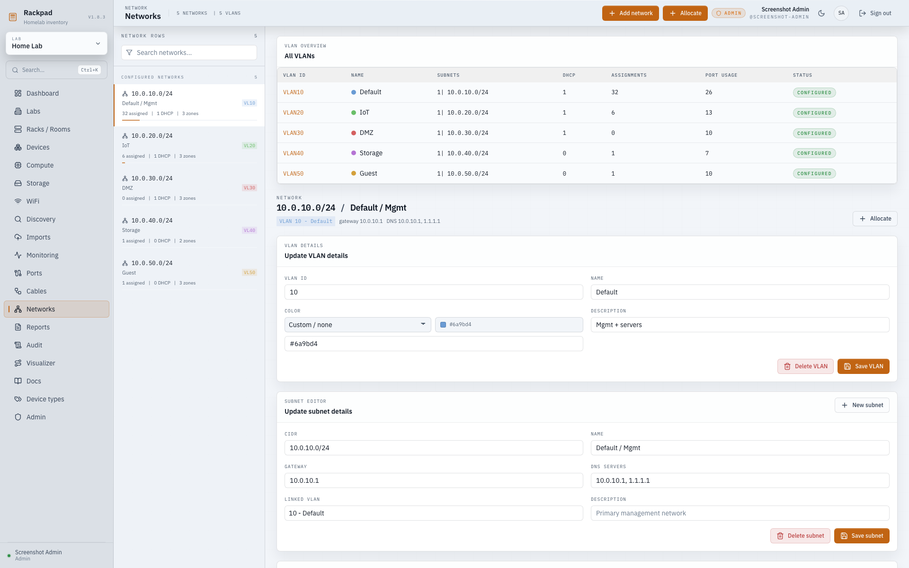
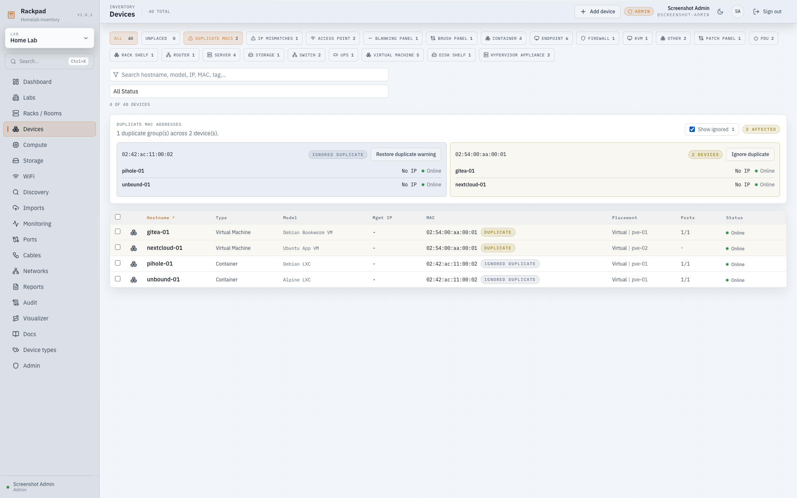
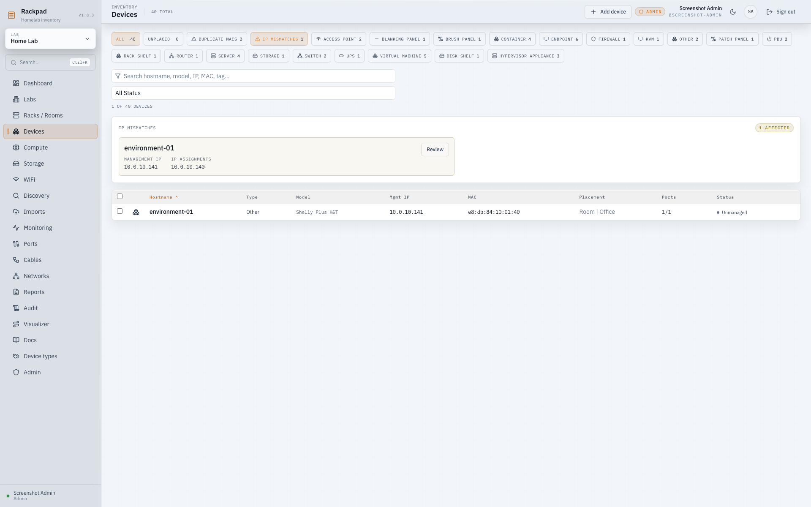

# Networks, VLANs, DHCP, and IPAM

Rackpad's Networks workspace is the shortest path for documenting common
homelab network layouts. It can create a VLAN, subnet, gateway/DNS records,
DHCP pool, and IP zones together, or it can document an untagged subnet without
forcing a VLAN record.

## Screenshots

### Consolidated Networks workspace

### Duplicate MAC review

### Management-IP mismatch review

## Subnet integrity

Rackpad stores IPv4 CIDRs in canonical network form and rejects equivalent or
overlapping subnets inside the same lab. Legacy overlaps are preserved, marked
read-only, and shown in the administrator data-integrity panel. An administrator
must move a conflicted subnet to a non-overlapping CIDR or explicitly delete it;
Rackpad never merges or deletes legacy IPAM data automatically.

## Finding assigned IPs

Device inventory search includes every valid IP assignment attached directly to
the device, not just its management IP. When an assigned address matches the
search, Rackpad shows that address beneath the management IP so the result is
easy to identify.

Use the **IP mismatches** filter on `Devices` to find a conservative class of
inconsistency: a device has a management IP and one or more device-level IP
assignments, but none of those assignments records the management IP.
Interface assignments do not trigger this warning, and an extra device address
is allowed when a matching management assignment also exists. Choose
**Review** to open the device's Network tab and resolve the records manually;
Rackpad does not change either address automatically.

Global search also identifies the owning device for assigned IPs and opens its
Network tab directly. An assignment without an owning device continues to open
its containing subnet.

## Simple tagged VLAN network

Use this when a subnet lives on a tagged VLAN, such as `VLAN 20` for IoT or
`VLAN 100` for servers.

1. Open `Networks`.
2. Choose `Add network`.
3. Select `VLAN tagged`.
4. Enter the VLAN ID, name, subnet CIDR, gateway, and DNS servers.
5. Enable DHCP only if that subnet hands out dynamic leases.
6. Add static or reserved zones if you want Rackpad to keep those address ranges
   visually separate.
7. Save the network.

The created row shows the VLAN, subnet, gateway/DNS, DHCP scopes, zones, and
assignments together so you do not need to jump between separate VLAN and IPAM
screens for normal review.

## Simple untagged network

Use this for a default LAN, management subnet, or any subnet that should not
carry a VLAN tag in Rackpad.

1. Open `Networks`.
2. Choose `Add network`.
3. Select `No VLAN tag`.
4. Enter the subnet CIDR, name, gateway, and DNS servers.
5. Add DHCP and zones if needed.
6. Save the network.

Rackpad creates the subnet and IPAM data without creating a VLAN record.

## DHCP scopes, zones, and reservations

A DHCP scope documents the dynamic lease pool for a subnet. A DHCP reservation
is still an IP assignment, but it must reference a DHCP scope so Rackpad knows
which pool owns the reservation.

Good default pattern:

- Gateway and DNS: document on the subnet so they are protected as technical
  addresses.
- DHCP scope: document only the dynamic pool, for example
  `10.0.20.100-10.0.20.199`.
- Static zone: document server, switch, firewall, and appliance ranges that are
  manually assigned.
- Reserved zone: document addresses you do not want Rackpad to allocate.

If every client address is managed through DHCP reservations, create the DHCP
scope first, then create device assignments as `DHCP reservation`. Rackpad will
keep the assignment tied to the scope and reject host assignments inside a DHCP
pool when they are marked as plain static addresses.

## VLAN ranges

VLAN ranges are optional planning labels. They help group or reserve blocks of
VLAN IDs, but they do not create networks, subnets, DHCP scopes, or IP zones by
themselves.

Use VLAN ranges when you want:

- a planned block such as `10-49` for infrastructure or `100-199` for tenants
- a visual reservation for VLAN IDs that should not be reused
- a quick way to see which tags are already documented

Skip VLAN ranges when you only need a few one-off homelab VLANs. The `Add
network` flow can create single VLAN networks directly.

## Things intentionally not modeled yet

Rackpad does not yet model VRFs/routing domains or shared switch fabric
capacity. Subnet overlap is therefore forbidden within a lab, and report
capacity remains based on documented port links rather than chassis backplane
throughput.
