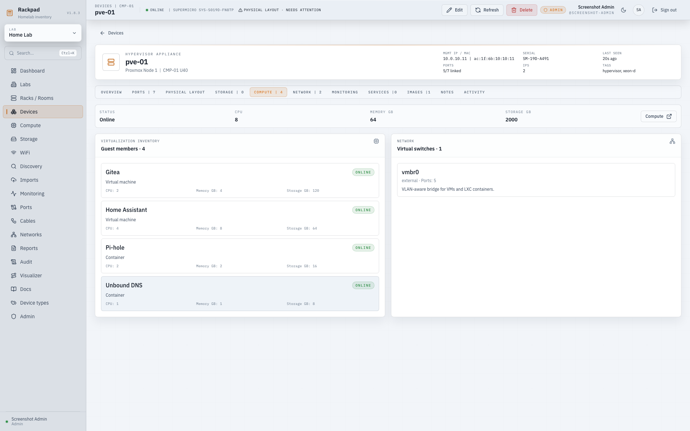

# Proxmox Import

Rackpad can stage a Proxmox node inventory from a JSON file generated on the
Proxmox VE host. The importer is review-first: it shows the node, Linux bridges,
QEMU VMs, LXC containers, virtual NICs, VLAN data, MAC addresses, IPs, CPU,
memory, disks, boot flags, and notes before anything is written.

Nothing is imported until you review the wizard and click `Import selected`.
The Proxmox node does not need to exist in Rackpad first: the wizard can create
it, auto-match an existing host, or let you select the exact existing device the
VMs and containers should live under.

After import, the host's **Compute** tab keeps its capacity, virtual switches,
VMs, and containers together:



## What Rackpad Can Import

- Proxmox node as a server device.
- Editable host staging, including host mapping, hostname, display name,
  vendor/model, OS, Proxmox version, kernel, CPU, RAM, and notes before import.
- QEMU VMs as VM device records with parent-host links.
- LXC containers as container device records with parent-host links.
- Workload power state mapped to Rackpad health.
- Proxmox VMID, node name, workload type, template flag, boot flag, uptime, and
  source tags in specs/notes.
- CPU, configured/max memory allocation, storage, disk controller, disk storage,
  and disk notes.
- Linux bridges and OVS-style bridge names as compute bridge records.
- QEMU and LXC network adapters as virtual ports.
- MAC addresses, bridge names, access VLAN tags, trunk VLANs, and virtual NIC
  model/type.
- Management IPs and additional IPAM assignments when matching Rackpad subnets
  exist.
- Host adapters and bridge IPs from the Proxmox node.

## 1. Collect Inventory On The Proxmox Node

Download the collector from Rackpad -> `Imports` -> `Download` in the Proxmox
card, or copy [../scripts/collect-proxmox.sh](../scripts/collect-proxmox.sh) to
the Proxmox node.

Then run it on the Proxmox node:

```bash
chmod +x ./collect-proxmox.sh
sudo ./collect-proxmox.sh --output ./rackpad-proxmox-inventory.json
```

The collector uses local Proxmox and Linux commands only: `pvesh`, `pct`, `ip`,
and `pveversion`. For LXC containers it can fall back to `pct list`,
`pct config`, and `pct status`; for running LXC containers it can also use
`pct exec ... ip -j address show` to collect live IPs. It does not send data
anywhere.

Expected output:

```text
Rackpad Proxmox inventory written to ./rackpad-proxmox-inventory.json
```

The JSON file is safe to inspect before upload, but it may contain internal host
names, IP addresses, MAC addresses, bridge names, VM/container notes, and source
tags.

### Collector Options

```bash
./collect-proxmox.sh --help
./collect-proxmox.sh --node pve01 --output ./rackpad-proxmox-inventory.json
./collect-proxmox.sh --no-guest-network --output ./rackpad-proxmox-inventory.json
./collect-proxmox.sh --no-host-adapters --output ./rackpad-proxmox-inventory.json
```

Use `--no-guest-network` when you only want config-derived IPs and do not want
the collector to ask the QEMU guest agent or run `ip address` inside running LXC
containers.

## 2. Import In Rackpad

1. Open `Imports` in Rackpad.
2. Upload `rackpad-proxmox-inventory.json`.
3. In the host panel, choose where the import should attach:
   - `Auto match or create` to let Rackpad match by node name/FQDN or create a new server.
   - An existing Rackpad device if the node already exists under a different name.
4. Edit the staged host fields if needed:
   - Hostname and display name
   - Manufacturer and model
   - OS and OS version
   - CPU cores and memory
   - Notes or missing info
5. Choose the categories to import:
   - Host record
   - Workloads
   - CPU, RAM, disks, and OS/spec notes
   - IPs
   - Virtual switches/bridges
   - Virtual ports
   - VLANs
6. Review every QEMU VM and LXC container, then fill in anything Proxmox could
   not report.
7. Click `Import selected`.

If `Host record` is checked, Rackpad creates or updates the selected/matched
host record. If `Host record` is unchecked, the selected/matched host is only
used as the parent for VMs, containers, and virtual switches.

## Review Wizard Checklist

Before importing, check:

- The Proxmox node target is correct: auto-create, auto-match, or manually
  select an existing Rackpad host.
- Workload hostnames are clean and unique.
- LXC containers are expected to import as `container` device types.
- Primary IPs are in Rackpad IPAM subnets if you want assignments created
  automatically.
- Any IP conflict badges are intentional. Rackpad skips conflicting primary IPs
  instead of overwriting existing IPAM assignments.
- Bridge names, MAC addresses, access tags, and trunk VLANs look right.
- RAM values reflect the configured/max allocation. Live memory usage from the
  collection moment is kept as separate review metadata when available.
- The selected category toggles match what you want imported this pass.

## Recommended Import Order

For a clean first import:

1. Create or import VLAN ranges and IPAM subnets first if you already know them.
2. Run the Proxmox collector on the node.
3. Import the host, bridges, workloads, specs, ports, VLANs, and IPs.
4. Open `Compute` to review host/VM/container relationships and bridges.
5. Open `Ports` to review virtual NICs and VLAN mode.
6. Open `IPAM` to review created assignments.

You can rerun the collector later and re-import. Existing devices are matched by
hostname/display name and updated rather than duplicated.

## Notes And Limits

- QEMU guest IPs require the QEMU guest agent to be installed, enabled, and
  reachable from Proxmox.
- LXC live IPs are collected from running containers with `pct exec ... ip -j
  address show`. Stopped containers usually only expose static IPs from their
  config.
- IPs are only written into IPAM when they fall inside an existing Rackpad
  subnet. If a subnet is missing, create it first or keep the IP in the staged
  notes.
- VLAN ranges such as `1-4094` are recorded in port notes but are not expanded
  into thousands of VLAN records. Discrete VLAN IDs are imported.
- Existing host, VM, and container devices are matched by hostname/display name
  and updated rather than duplicated. The host selector can override the
  automatic host match when your Rackpad record uses a different name.
- The collector targets one Proxmox node at a time. Run it once per node when
  you want to stage a whole cluster.

## Troubleshooting

### `pvesh` is missing

Run the script on a Proxmox VE node. The collector depends on local Proxmox
commands and is not meant to run from your desktop.

### QEMU VMs have no guest IPs

Install and enable the QEMU guest agent in the VM, enable the guest agent option
in Proxmox, then rerun the collector. You can also type the primary IP manually
in the import wizard before importing.

### LXC containers have no live IPs

Stopped containers usually do not expose live interface data. Start the
container and rerun the collector, or keep the IP from the container config if
it is static.

### The node name does not match

Pass the Proxmox node name explicitly:

```bash
sudo ./collect-proxmox.sh --node pve01 --output ./rackpad-proxmox-inventory.json
```
