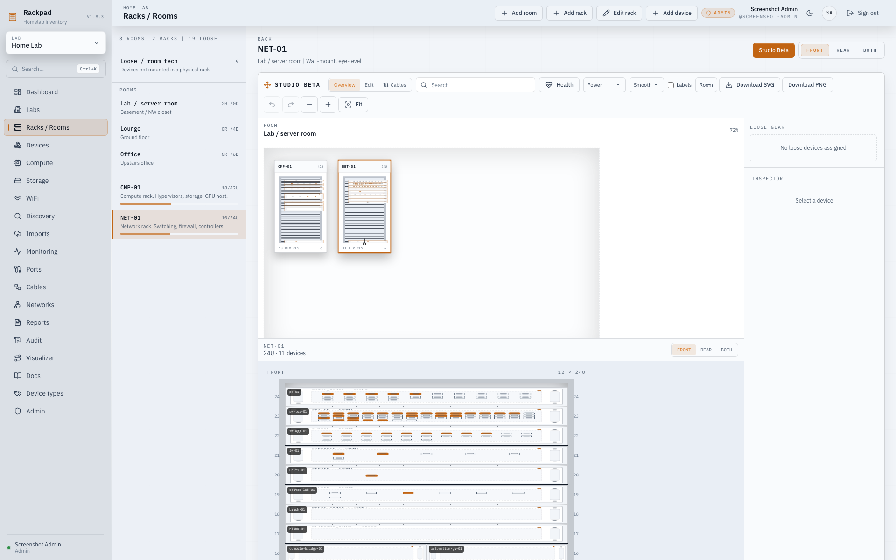

# Rack Studio and Accurate Physical Hardware Visualization

## Summary

Build a phased, original Rackpad Rack Studio that provides detailed front/rear rack elevations, exact physical port placement, reusable hardware templates, room-level placement editing, physical cable patching, and accurate hardware nodes in Visualizer. Existing devices, ports, and cables remain authoritative and must work immediately after upgrading through a versioned compatibility layout. No code, artwork, templates, constants, or assets from the referenced project will be reused.

Implementation proceeds sequentially behind a Studio Beta toggle. This document is the durable design and delivery plan.

Review-fix status: the five delivery phases and the follow-up correctness work
are implemented. Physical-layout reads and previews are pure, initialization and
port reconciliation happen only in transactional mutation paths, one
authoritative scene model now drives interaction/routing/export, and room bounds
grow deterministically for dense inventories. Studio remains opt-in while the
classic elevation remains the default.

## Architecture and Interfaces

### Hardware templates and physical layouts

Introduce these versioned domain contracts:

- `HardwareTemplateV1`: chassis category, mount defaults, front/rear definitions, optional module slots, port blueprints, drive-bay blueprints, and original visual primitives.
- `FaceDefinitionV1`: normalized 0–1000 canvas containing panels, handles, screws, vents, bays, displays, indicators, labels, port groups, and outlet artwork.
- `PhysicalPortSlotV1`: stable slot ID, face, coordinates, dimensions, rotation, connector shape, accepted port kinds, and optional group metadata.
- `ResolvedPhysicalLayoutV1`: immutable device snapshot produced from a template and selected hardware modules.
- `PortBindingV1`: actual Rackpad port ID mapped to a stable physical slot ID.
- `PhysicalLayoutStatus`: `accurate`, `legacy-default`, `generic-default`, `needs-mapping`, or `invalid`.

Persist:

- Custom hardware templates and device-type default assignments.
- A resolved physical-layout snapshot and explicit port bindings per device.
- Extended rack geometry: 12-column placement, shelf rectangle, orientation, mount kind, and left/right 0U mounting.
- Shared room-canvas rack positions.
- Later-phase cable labels and room/face-specific manual routing waypoints.

Built-in templates remain immutable Rackpad-authored definitions. Custom templates are administrator-managed and may be duplicated. Applying a template stores a device-owned snapshot, so later template changes or deletion cannot move existing ports or alter a documented device.

### Backward-compatible migration

- Create a `legacy-auto-v1` physical layout for every existing device using its current device type, port IDs, face, kind, and position.
- Preserve every device, port ID, port order, link, cable attribute, rack assignment, U position, and front/rear value.
- Convert legacy rack slots losslessly: full → columns 0/12, left → 0/6, right → 6/6.
- Existing linked ports receive deterministic default anchor positions; their cables render immediately without user action.
- Existing devices display a non-blocking `Physical layout needs configuration` badge and `Configure layout` action.
- Newly created devices without a selected hardware template receive `generic-auto-v1` and the same warning.
- Template application can create missing ports only after preview and confirmation. It cannot silently delete, rename, reorder, recreate, or disconnect existing ports.
- Port bindings use stable port IDs, so port-label changes do not move cables. Added ports become `Needs mapping`; removed ports are removed from the binding map without shifting other mappings.

### APIs and permissions

Add authenticated APIs for listing templates and lab-scoped physical layouts.

- Global administrators can create, duplicate, update, assign defaults, and delete custom hardware templates.
- Lab editors and administrators can select templates, configure device variants, map ports, and edit physical placement.
- Viewers can inspect layouts but cannot mutate them.
- A physical-layout preview endpoint resolves modules, proposes port bindings and port creation, reports conflicts, and returns a fingerprint of the current port set.
- Applying the preview verifies the fingerprint and writes the layout, approved new ports, and mappings atomically; stale previews return `409`.
- A later Rack Studio action endpoint handles placement, rack movement, cable mutations, and safe inverse actions.
- Browser-session undo/redo sends expected before/after state; it refuses to overwrite a newer conflicting change.
- Every canonical mutation is lab-authorized, parameterized, transactional, and audited.
- New tables and fields participate in logical backup, restore, integrity validation, legacy-backup compatibility, and schema coverage.

## Delivery Phases

### Phase 1 — Compatibility-safe physical-layout foundation

- Save this plan to `docs/RACK_STUDIO_DESIGN.md`.
- Add the versioned types, validation, database migration, backup/restore coverage, route authorization, and physical-layout APIs.
- Generate `legacy-auto-v1` snapshots and mappings for existing devices without modifying their real ports or links.
- Build the shared original DOM/SVG faceplate renderer with light/dark support, deterministic generic front/rear layouts, real port shapes, linked-port highlighting, and existing cable anchors.
- Add a `Physical layout` section under Device settings showing status, front/rear preview, actual ports, mapped slots, existing cable destinations, and the configure action.
- Add warning badges to Device details, Rack view, and detailed Visualizer inspection without blocking normal usage.
- Add the Studio Beta toggle with a read-only compatibility preview; the current rack elevation remains the default.
- Phase 1 is complete when an upgraded populated database displays every existing cable against a stable default physical layout with zero inventory or link changes.

### Phase 2 — Hardware Template Builder and exact device configurations

- Add the visual Hardware Template Builder under Device Types.
- Provide original parameterized starting families: generic 1U/2U/4U servers, desktop/tower PCs, storage equipment, firewalls, routers, 8/16/24/48-port switches, patch panels with matching face-qualified front/rear blocks, PDUs, UPS units, KVMs, shelves, and blanking panels.
- Provide original module primitives for NIC blocks, PCIe adapters, PSUs, fans, drive bays, management ports, console, USB, serial, VGA, SFP/SFP+/QSFP, and other physical connectors.
- Allow users to generate port blocks by count, rows, columns, starting number, numbering direction, and connector kind, then click or drag ports into exact positions.
- Support left-to-right, right-to-left, vertical, and serpentine port sequencing plus separate uplink blocks.
- Allow base chassis plus installed-module variants, such as integrated NICs combined with a separate two-port PCIe card.
- Offer automatic port matching followed by visual confirmation. Never hide unmatched ports; place them in `Needs mapping`.
- Allow one-device customization or administrator-only saving as a reusable template.
- Add bulk profile assignment for identical devices while retaining each device’s unique port IDs and cable links.
- Provide compare/update-from-template with an explicit merge preview; existing linked ports cannot be removed by this workflow.

### Phase 3 — Editable room-level Rack Studio

Implementation status: completed behind the Studio Beta toggle. The shared room
canvas, focused rack editor, unmounted equipment tray, 12-column direct mounts,
shelf footprints and rotation, 0U side mounts, rack-top surfaces, pointer and
keyboard editing, zoom/pan/fit, search and health overlays, inspectors,
responsive view-only mode, and conflict-safe session undo/redo are implemented. Studio actions are
lab-authorized, transactional, audited, and protected by expected before-state.
The room and focused views now consume the same `RackStudioScene` geometry as
cable routing and export. Direct, shelf, rotated shelf, side, rack-top, and loose
devices all render device-owned faceplates with exact transformed anchors.
Front, rear, and both selection is authoritative: fully hidden cables are
omitted and a single visible endpoint terminates at a labeled hidden-face
handoff.

- Replace the beta preview with a room canvas showing all racks in the room, an unmounted equipment tray, and individual-rack focus.
- Render industrial-technical front/rear faceplates with equipment depth, handles, screws, vents, bays, labels, status LEDs, and exact port geometry.
- Add explicit View/Edit mode, desktop/tablet pointer support, keyboard controls, zoom/pan/fit, search, health overlay, face selection, and inspector forms.
- Support integer U height plus a 12-column width grid for direct mounts.
- Support bounded 2D shelf placement, 90° rotation, vertically installed devices, and left/right 0U side equipment.
- Support one 12-column rack-top surface per rack, with horizontal pointer and
  keyboard placement, face selection, overlap rejection across both faces, and
  vertical position derived from the rack.
- Preview valid footprints and collisions before drop. Reject rack overflow, overlapping column/U ranges, overlapping shelf rectangles, invalid parent shelves, side conflicts, and cross-lab placement.
- Save each completed action transactionally and support conflict-safe session undo/redo.
- Keep phone layouts view-only with a clear editing-size message.

### Phase 4 — Accurate physical nodes in Visualizer

Implementation status: completed as an opt-in Diagram node style. Visualizer now
reuses each device-owned snapshot and the shared faceplate renderer for exact
front, rear, or combined hardware nodes. Cables attach to stable physical port
coordinates, linked opposite faces are revealed automatically, distant views
retain endpoints while simplifying artwork, and close views restore labels and
detail. Rack-mounted and loose physical devices use the same rendering path;
virtual and wireless inventory retains the compact Diagram card.

- Add a `Physical` Visualizer node style alongside existing compact Diagram cards.
- Reuse the same faceplate renderer and device-owned physical snapshot; do not create a separate diagram profile.
- Show the front, rear, or both faces. If visible links terminate on both faces, render both rather than moving ports to artificial node edges.
- Anchor React Flow handles to exact physical port coordinates.
- Simplify artwork automatically at distant zoom levels while retaining cable endpoints; reveal full labels and port detail when zoomed in.
- Support accurate physical nodes for rack-mounted and loose devices.
- Ensure the same port is visually identical and receives the same cable in Device settings, Rack Studio, and Visualizer.

### Phase 5 — Physical patching, smart routing, tracing, and export

Implementation status: completed behind the Studio Beta toggle. Physical Patch
mode creates canonical `PortLink` records from exact mapped faceplate ports,
keeps logical and aggregate relationships out of the physical workflow, and
requires confirmation for unusual connector pairs. Cable inspection now covers
labels, type, length, color, notes, visibility, deletion, tracing, filters, and
bounded room/face waypoints. Room and focused-rack views share one deterministic
exterior-gutter planner. Stable endpoint ordering plus interval-based lane reuse
avoids fixed modulo collisions, treats unrelated rack/equipment rectangles as
obstacles, and preserves exact manual waypoints while racks move. Smooth rounded
and orthogonal renderers consume the same points; namespaced local preferences
store the chosen style and all-label setting. Cross-room links terminate as
labeled handoffs. Theme-aware full-room and focused-rack SVG and PNG exports use
the same planned geometry and include selected faces, physical ports, cable
labels, metadata, and a legend. Exports use the same scene and face filtering as
the interactive view, including shelf, side, rack-top, and loose equipment.
Studio remains opt-in; this phase does not make it the default.

- Add Patch mode for creating real `PortLink` records by selecting or dragging between available physical ports.
- Support copper, fiber, power, console, USB, and other physical links. Keep virtual, WiFi, VLAN, and aggregate relationships in Diagram mode.
- Reject occupied endpoints and self-links. Warn and require confirmation for unusual physical connector pairings.
- Add cable inspection, label, type, length, color, notes, visibility controls, filters, deletion confirmation, and existing trace integration.
- Auto-route same-room cables by face, equipment position, cable kind, rack gutters, and stable lane assignment.
- Allow optional user-created routing waypoints. Moving racks recalculates automatic segments while preserving valid manual waypoints.
- Represent cross-room cables as labeled off-canvas handoffs rather than inventing a hidden route.
- Add full-room and focused-rack PNG/SVG export with selected faces, title block, room/rack metadata, cable legend, labels, and theme-correct colors.
- Make Studio the default only after one stable release without unresolved parity regressions; remove the classic elevation through a later explicit cleanup.

## Test and Acceptance Plan

- Migration tests prove populated legacy databases retain identical device, port, and `PortLink` IDs and metadata.
- Backup tests cover new tables/fields, old backups without physical layouts, newer-schema rejection, atomic restore, and device snapshots after template deletion.
- Profile tests cover schema validation, bounds, element limits, module resolution, deterministic expansion, inherited defaults, exact port bindings, unmatched ports, and prohibited arbitrary SVG/URLs/scripts.
- Placement tests cover full/half/third-width devices, U overlap, shelf bounds and rotation, vertical equipment, side and rack-top mounting, cross-lab rejection, and safe undo conflicts.
- Cable tests cover existing linked devices, physical endpoint validation, network/power/console links, cross-rack routes, cross-room handoffs, waypoint validation, trace behavior, and aggregate exclusion.
- Browser tests cover administrator/editor/viewer permissions, legacy warnings, profile creation, template application, exact manual mapping, bulk assignment, touch editing, phone view-only behavior, front/rear/both rendering, Physical Visualizer nodes, and CSP-safe PNG/SVG export.
- Required scenarios:
  - A generic 2U server with six rear NICs positioned two left, two center, and two right.
  - A 24-port switch with configurable numbering and separate 10G uplinks on the correct side.
  - Two devices using the same base template but different installed adapters and port layouts.
  - Existing linked devices upgraded without cable or port changes.
  - An added port producing a mapping warning without shifting existing anchors.
  - A cable terminating on the same exact port in Rack Studio and Physical Visualizer mode.
- Add a dense deterministic fixture with multiple racks, hundreds of devices, and heavy cabling to catch routing instability or excessive rendering cost.
- Run targeted client/server checks during each phase, `npm run check` before phase completion, and `npm run check:full` plus deterministic screenshots before enabling Studio by default.
- Authorization, migration, backup/restore, and cable mutations require independent review.

Review-fix acceptance coverage includes pure viewer GET/preview regression
tests, all normal device/port initialization and reconciliation paths, reserved
template/default restore rejection with atomic failure, room-derived rack and
waypoint bounds, exact hidden-face handoffs, and a deterministic fixture with 15
racks, 300 mixed-placement devices, and 500 links. The dense fixture asserts
that repeated scene and route builds are identical and that no devices are
discarded from scene or export output.

## Deferred after Studio Beta

- Free dragging and persistence of loose-device tray positions remains deferred;
  loose gear uses a stable generated grid.
- Breakout and fan-out modeling remains deferred; one Rackpad port maps to one
  physical slot.
- Making Studio the default and removing the classic elevation remain separate
  release decisions after a stable opt-in release with no parity regressions.

## Assumptions and Constraints

- Devices, ports, racks, and `PortLink` records remain the only canonical inventory and cabling data.
- Generic template generators cover common configurations; Rackpad will not claim to enumerate every hardware model.
- Model-specific layouts may be authored from factual measurements or official specifications, but all visual artwork remains original and excludes copied illustrations and third-party logos.
- One Rackpad port maps to one physical slot in the initial implementation; breakout/fan-out port modeling is deferred.
- Reference photographs remain documentation assets and are not used as hardware faceplates.
- No new graphics dependency, public unauthenticated route, environment variable, container change, deployment, or release action is required.
- Existing uncommitted work must be preserved; implementation must recheck Git status and carefully reconcile overlapping server composition, route authorization, tests, and AI guardrail changes.

## Automatic short patch cords

Smooth routing now uses shared cubic geometry for different devices on the same
rack face within 4U, provided a conservative control-point hull is clear of
unrelated equipment. Endpoint shelves are excluded from collision checks. Long,
obstructed, cross-rack, handoff, and explicitly waypointed links retain gutter
or manual routing. Rack Studio room/elevation views, Rack Cabling, and SVG/PNG
exports consume the same geometry and stable port identities. The general
free-position Visualizer graph retains its own layout routing.
