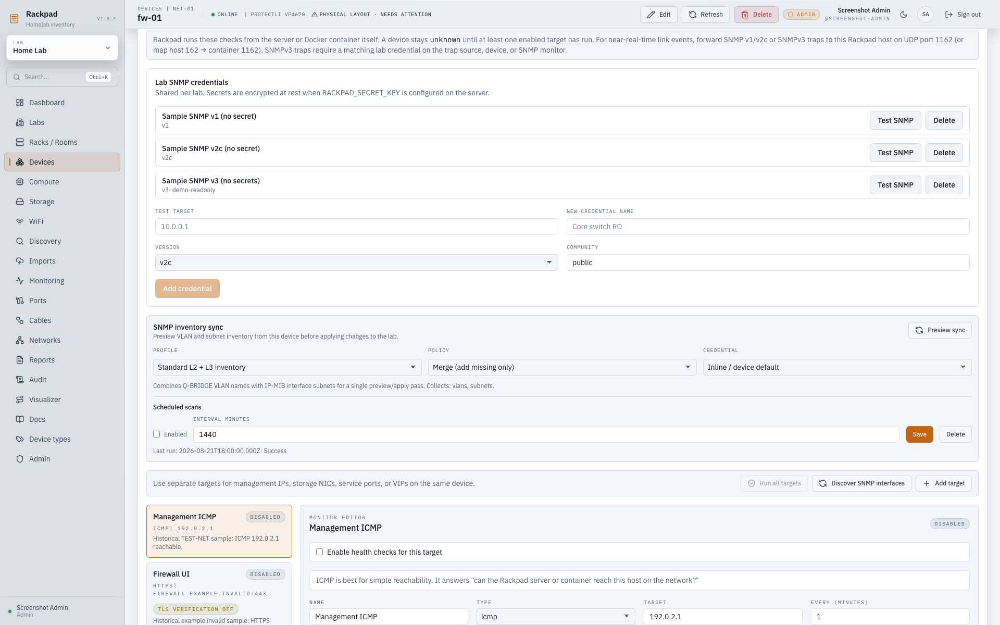

# SNMP monitoring, traps & inventory sync

Rackpad can poll devices over SNMP, receive SNMP traps, reflect interface
link-state, and (optionally) sync VLANs, subnets, and DHCP scopes from network
gear into IPAM.

This is the current operator/admin guide. The old implementation plan is retained
only as historical design evidence and must not be used as a feature-status list.

## What you get

- **SNMP monitors** (v1 / v2c / v3) alongside ICMP / TCP / HTTP / HTTPS checks
- **IF-MIB interface monitoring** — per-port link state, with `ifHighSpeed` used to
  fill in a port's speed when it's blank
- **SNMP-verified badges** in Ports, the Dashboard, and the Visualizer
- **Trap receiver** (v1 / v2c / authenticated v3) for `linkUp` / `linkDown` with device auto-learn
- **Inventory sync** (opt-in) — preview/apply VLANs, subnets, and conflict-free
  DHCP scopes from a device into IPAM, manually or on a per-device schedule

## Quick start (v2c)

1. Set and retain `RACKPAD_SECRET_KEY`, then enable SNMP on the device with a read-only community string.
2. In Rackpad, open **Monitoring** (or a device's **Monitoring** tab) and add a
   monitor of type **SNMP**.
3. Choose version **v2c**, enter the **community** string and the **OID** to check
   (e.g. an `ifOperStatus` OID for a port), pick a match mode, and save.
4. Run the check. The result and any linked port's link-state update on success.

Match modes include exact equality, inequality, comma-separated membership,
any value, and bounded regular expressions. Regex patterns are limited to 200
characters and use a non-backtracking RE2-compatible engine; invalid patterns
are rejected when the monitor is saved.

## SNMP versions

### v1 / v2c

A read-only **community** string per monitor, stored encrypted with
`RACKPAD_SECRET_KEY`. The community still travels in cleartext on the SNMP v1/v2c
network, so keep SNMP on a trusted management network.

Community fields are write-only. API responses return `snmpCommunity: null` and
`hasSnmpCommunity`; they never return the secret or its ciphertext. When editing,
leave the field blank to preserve it, enter a replacement, or choose **Clear**.
API PATCH requests preserve omitted values and clear inline configuration with
explicit `null`. Interface discovery can reuse a selected monitor's stored inline
community through its device-scoped `monitorId`; credential-backed imports retain
the credential reference without copying the secret.

### v3 (recommended on shared networks)

SNMPv3 adds auth + privacy. Credentials are stored **per lab, encrypted at rest**
(AES-256-GCM):

1. Set `RACKPAD_SECRET_KEY` before storing any SNMP credential or inline community (see env table).
   Generate one with `openssl rand -hex 32`. Without it, storing SNMP secrets fails; the other monitor types remain available.
2. Open a device's **Monitoring / SNMP** area and add SNMPv3 credentials
   (security name, auth protocol + key, privacy protocol + key).
3. Create an SNMP monitor that uses v3.

Rotating `RACKPAD_SECRET_KEY` invalidates stored SNMP and integration secrets — re-enter them after a
key change.

The supported v3 combinations are MD5 or SHA (USM SHA-1) authentication,
with no privacy (`authNoPriv`) or AES128 (`authPriv`). Select the same protocols
and passwords as the device. The 1.8.3 candidate corrects key localization and
AES wire encoding; existing stored credentials and `RACKPAD_SECRET_KEY` remain
unchanged. Cisco IOS-XE hardware acceptance is tracked separately in #152.

Responses must authenticate and match the requested peer, engine, username,
context and request. Engine discovery alone never establishes trust. A verified
engine-time report can trigger one retry within the original request deadline;
invalid authentication never triggers a downgrade to v2c or unsigned v3.

## Interface monitoring & port link-state

An SNMP monitor can be linked to a specific port via its `ifIndex`. When linked,
poll results (and matching traps) drive the port's link-state badge across Ports,
the Dashboard, and the Visualizer. Discover/import reads IF-MIB so a port's speed
can be auto-filled from `ifHighSpeed` when it isn't set manually.

## Traps

The UDP trap receiver is disabled by default. Set `SNMP_TRAP_ENABLED=1` to start it.

- **Default port: 1162** (unprivileged on purpose, so containers don't need extra
  capabilities). Forward your network's standard **162 → 1162** upstream, or point
  agents directly at 1162.
- **Docker:** normal Compose passes the trap settings into Rackpad but deliberately
  does not publish UDP. Add `1162:1162/udp` explicitly (or use host networking)
  when external traps must reach the listener.
- Incoming v1/v2c `linkUp`/`linkDown` traps update the matching monitor/port; an
  unknown source IP may be associated with an existing device, but observed
  communities and incoming credential IDs never establish trust. Duplicate traps are
  de-duplicated within 30 seconds.
- SNMPv3 `linkUp`/`linkDown` traps are supported for authenticated and encrypted
  USM credentials. Map the trap source, device, or SNMP monitor to the matching
  lab credential so Rackpad can validate and decrypt the packet. The configured
  authentication/privacy level is required; unsigned or downgraded packets cannot
  update monitors. Verified engine clocks reject older boot counts and stale
  messages outside the USM time window during the running process.

Configure with `SNMP_TRAP_ENABLED`, `SNMP_TRAP_PORT`, `SNMP_TRAP_BIND` (see table).
Receiver status is reported on `/api/health` and `/api/snmp-traps/status`.

## Inventory sync (preview / apply)

Off by default. Set `SNMP_INVENTORY_SYNC=1` to enable it, then use the **SNMP sync**
panel on a device's detail page to preview a diff and apply it.

- **Applies:** VLANs and subnets read from the device (Q-BRIDGE VLANs, IP-MIB
  subnets), plus DHCP scopes that belong to a collected subnet and do not
  overlap an existing scope.
- **Conflicts:** invalid, out-of-subnet, missing-subnet, and overlapping DHCP
  ranges remain unapplied and are reported explicitly in the preview.
- **Safety:** sync is a merge/mirror that **never silently deletes** existing
  assignments — review the preview before applying.
- **Profiles:** Rackpad ships a pfSense/OPNsense profile plus generic Q-BRIDGE
  and IP-MIB profiles. The generic profile remains the fallback.
- **Schedules:** administrators can enable one schedule per device, select its
  profile and merge/mirror policy, and set an interval of at least one minute.
  Scheduled mirror runs do not delete inventory automatically. Last success or
  failure is retained with the schedule.

## Environment variables

| Variable              | Default   | Purpose                                                                                                                          |
| --------------------- | --------- | -------------------------------------------------------------------------------------------------------------------------------- |
| `RACKPAD_SECRET_KEY`  | _(unset)_ | Encrypts SNMP credentials and inline monitor communities. Required to store those secrets. Use a long random value (`openssl rand -hex 32`). |
| `SNMP_INVENTORY_SYNC` | `0`       | Set `1` to enable VLAN, subnet, and conflict-checked DHCP scope sync.                                                            |
| `SNMP_TRAP_ENABLED`   | `0`       | Enable/disable the trap receiver.                                                                                                |
| `SNMP_TRAP_PORT`      | `1162`    | UDP port the trap receiver binds.                                                                                                |
| `SNMP_TRAP_BIND`      | `0.0.0.0` | Interface the trap receiver binds to.                                                                                            |

## Security notes

- Keep SNMP on a trusted management network; prefer v3 where possible.
- Treat community strings as secrets — they are read-only but still grant device
  visibility.
- Store `RACKPAD_SECRET_KEY` outside the repo (env / secrets manager); back it up,
  since losing it makes stored v3 secrets unreadable.

Administrators can inspect scheduler and queue state at the authenticated
`GET /api/admin/operations/status` endpoint. Public liveness behavior is
unchanged; Rackpad does not expose a public readiness endpoint.

## Upgrading existing SNMP configuration

Schema 50 encrypts legacy inline monitor communities atomically. If encryption
needs a missing `RACKPAD_SECRET_KEY`, startup stops without committing the
migration; supply the key and retry. Retain an existing key rather than replacing
it, because other stored credentials may already depend on it.

Historical trap-source communities and credential links are cleared: older
versions mixed manual configuration with values learned from packets. Device and
monitor credential references remain intact. Re-select any source-level credential
explicitly and enable traps only where required. For v1/v2c traps, trust resolves
from monitor credential, then configured source credential, then device credential,
then the encrypted inline monitor community. SNMPv3 uses only explicitly configured
credential references.

Legacy logical backups receive the same conversion during restore. Missing-key or
malformed-secret failures roll back the complete restore. Current backups preserve
encrypted communities and explicit source mappings. Existing backups remain
sensitive; rotate previously exposed communities on Rackpad and the devices after
upgrade. Rollback requires the matching old application and pre-upgrade database
and configuration snapshot, not an older binary against the migrated database.

TCP, ICMP, and SNMP probes validate DNS results before opening a socket or starting
ping. Private IPv4 and unique-local IPv6 LAN targets remain supported; loopback,
link-local/metadata, multicast, and reserved addresses are rejected. Transports use
the selected numeric address and bounded DNS/network timeouts.
