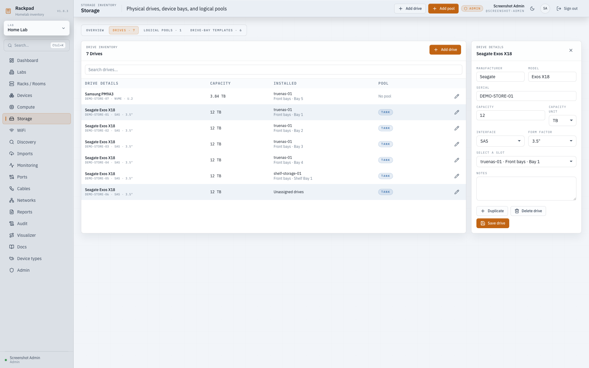
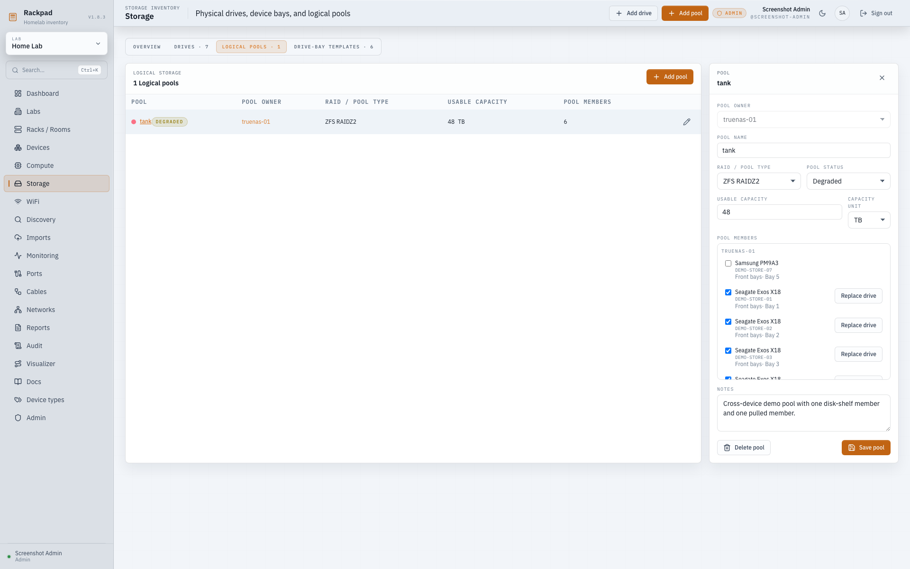
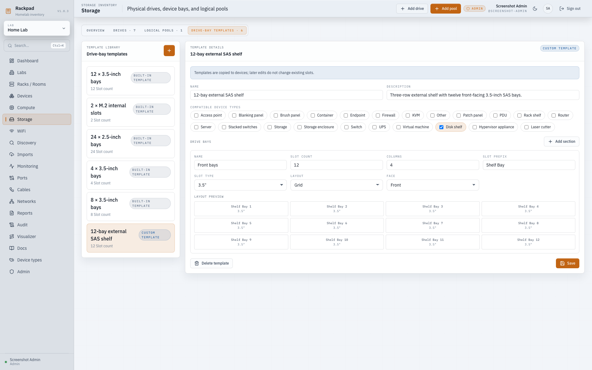
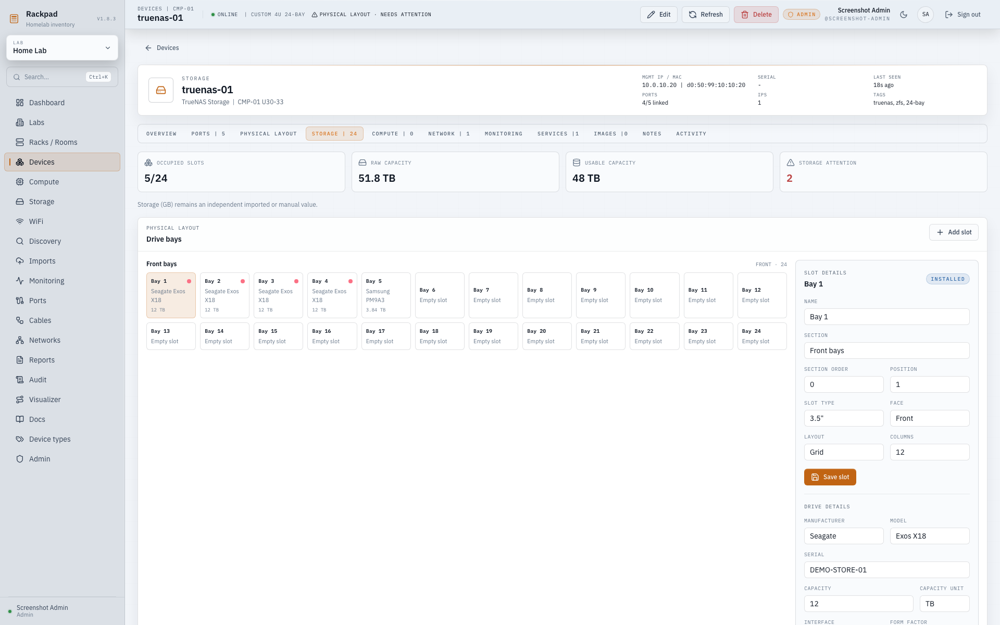

# Storage Topology

Rackpad Storage Topology documents physical drives, where they are installed,
and which logical pools use them. The stored device `Storage (GB)` field remains
an independent manual or imported value; topology never rewrites it.

The device Overview derives its displayed storage value without changing that
stored field. It shows the sum of usable capacity for pools owned by the device
when any owned pool exists, otherwise the raw capacity of drives installed on
the device, and otherwise the manual/imported `Storage (GB)` value. A source
label identifies **Usable topology**, **Raw topology**, or **Manual / imported**
so operators can distinguish the display calculation from stored data.

## Storage workspace

Open **Storage** in the sidebar. The workspace provides four views:

- **Overview** totals installed raw capacity, manually documented usable pool
  capacity, occupied slots, unassigned drives, unhealthy pools, and physically
  missing pool members. These topology totals do not mutate device fields.
- **Drives** searches manufacturer, model, serial, device, slot, and pool. An
  editor can create, duplicate, edit, move, pull, or delete inventory records.
- **Pools** lists the owner device, RAID or pool type, manual usable capacity,
  status, and complete member list.
- **Drive-bay templates** shows built-in and custom layouts. Everyone can read
  templates; only admins can create, edit, or delete custom templates.

The command palette also searches drive serials, manufacturers, and models.

### Storage workspace

### Installed, unassigned, and pulled drives

### Degraded cross-device pool

### Custom disk-shelf template

### Device storage topology

## Applying a bay template

Choose a **Drive-bay template** when creating a Server, Storage device, Storage
enclosure, or a compatible custom descendant. You can also apply one from an
empty device's **Storage** tab.

Templates are snapshots. They can only be applied while the device has no drive
slots, and later template edits never alter existing devices. Rackpad includes
starter layouts for 4, 8, and 12 3.5-inch bays, 24 2.5-inch bays, and two
internal M.2 slots.

## Drives and slots

A drive is a lab-owned inventory record with manufacturer, model, serial, raw
capacity in GB, interface, form factor, and notes. Capacity entry accepts GB or
TB and is stored canonically as GB.

A drive can occupy one slot, and a slot can contain one drive. Non-empty serial
numbers are unique within a lab. Moving a drive to another slot— including a
slot on another same-lab device—updates its physical location without changing
the drive record.

Deleting a device removes its slots but preserves its drives as unassigned lab
inventory.

Slot display properties are shared by every slot in the same device section.
Creating a slot in an existing section inherits that section's name, order,
face, layout, and column count. Editing any of those properties updates the
whole section in one transaction. Legacy sections with mixed settings show a
repair warning and remain unchanged until an editor saves section settings,
which normalizes the complete section.

Duplicating a drive copies its descriptive metadata but never copies its slot
or pool membership. The duplicate must use a new serial number or leave it
blank.

## Pools and missing members

Pools belong to a host device and contain a flat list of drives. The pool type,
usable capacity, health status, and notes are manual documentation fields;
Rackpad does not calculate RAID capacity.

A new pool member must be installed in a slot and belong to the owner's lab.
The physical slot may be on the owner, another server, or a Storage enclosure.
A drive can belong to only one pool.

Pulling a pool member from its slot preserves pool membership and marks it as
physically missing. This models failed or removed disks without losing logical
history. A pool member cannot be permanently deleted until it is removed from
the pool. Pool membership changes are validated and committed atomically.

The replacement action creates a new drive record, preserves the physical slot,
and swaps pool membership in one transaction. The retired drive is left
unassigned by default; API clients may explicitly request deletion only when
the same safety checks permit it.

## Permissions and backups

- Viewers can inspect storage in labs they can access.
- Editors can manage slots, drives, and pools in writable labs.
- Admins can also manage global drive-bay templates.

Admin backups contain custom templates, drives, slots, pools, and memberships.
Older backups without storage arrays remain valid and restore with an empty
storage topology.

## Deferred scope

Storage Topology v1 does not model nested vdevs, calculate RAID capacity,
validate HBA or enclosure cabling, or import physical disks from Proxmox,
Hyper-V, SNMP, or other discovery sources.
