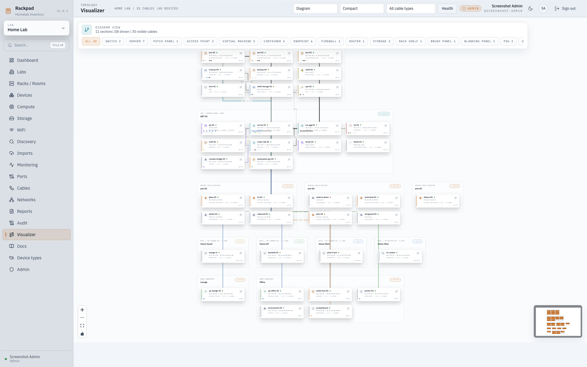
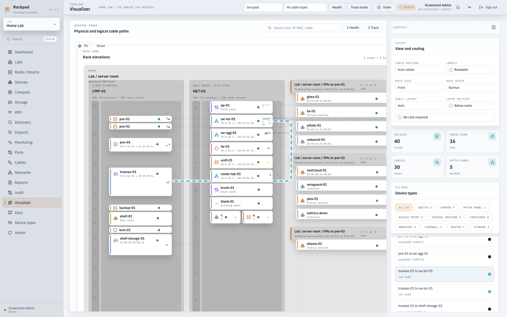
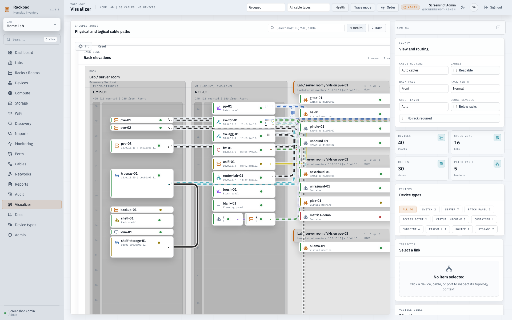
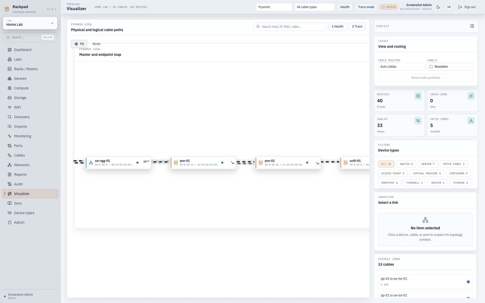
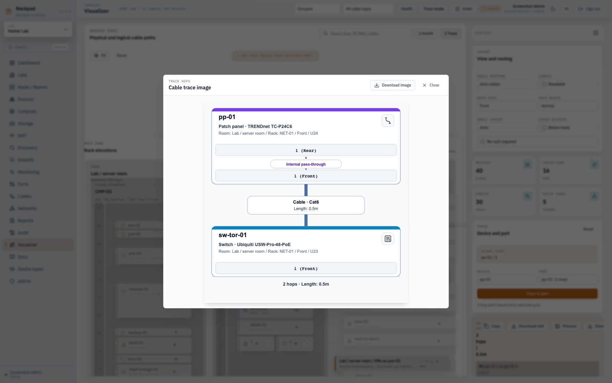
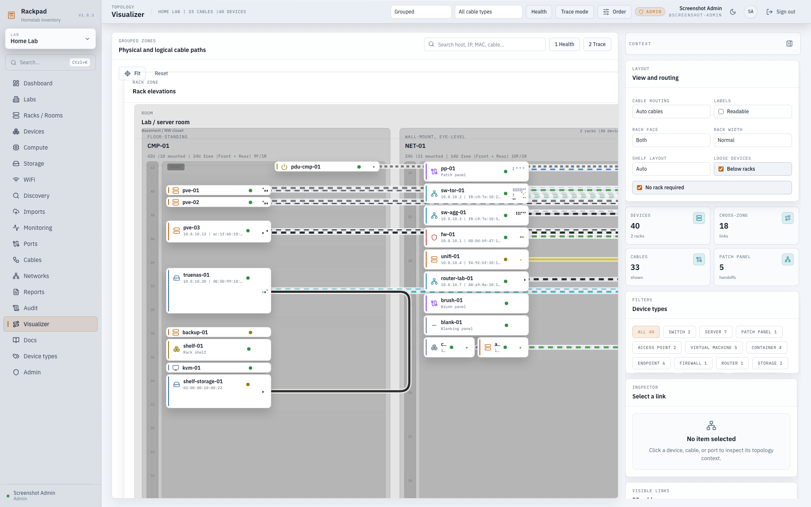
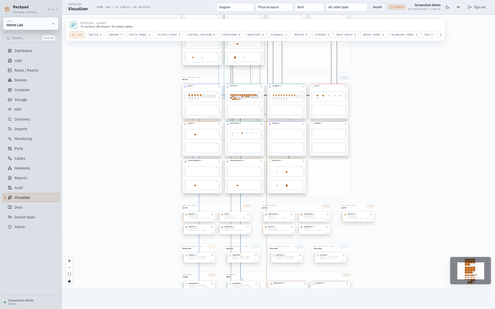
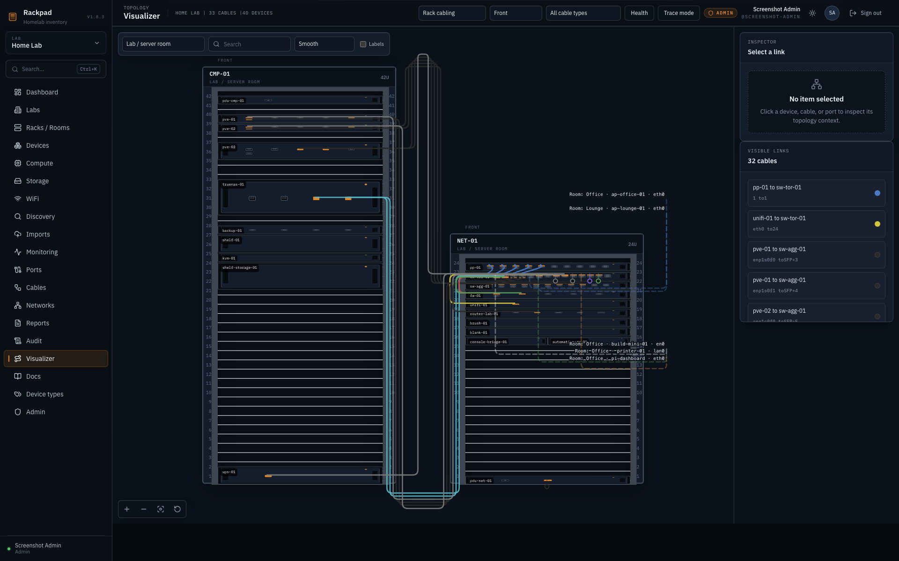

# Visualizer

The Visualizer is Rackpad's read-only physical topology workspace. It renders
existing inventory records as grouped rack and room zones, then overlays the
documented cable paths between ports.

Open Rackpad -> `Visualizer`.

## Screenshots

| Topology and cable paths                                     | Selected cable inspector                                                  |
| ------------------------------------------------------------ | ------------------------------------------------------------------------- |
|  |  |

| Health overlay                                                            | Pyramid layout                                                          |
| ------------------------------------------------------------------------- | ----------------------------------------------------------------------- |
|  |  |

| Multi-hop trace preview                                                  | Loose devices below racks                                                      |
| ------------------------------------------------------------------------ | ------------------------------------------------------------------------------ |
|  |  |

Physical nodes reuse each device-owned front/rear layout so their visible ports
and cable endpoints match Rack Studio and Device settings.

The `Rack cabling` layout shows one room as bottom-aligned, full-height rack
elevations with cables attached to their exact physical ports.

## What It Shows

- Rack-mounted equipment grouped in the left rack-elevation zone, with racks
  separated into their assigned Rooms.
- Loose, room, shelf, WiFi, hosted VM, and virtual-context devices grouped in
  the right zone with room context.
- Room/loose groups by Room first, then matching IPAM subnet when subnets exist,
  otherwise by device type or virtual host.
- Cable paths from existing `Cables` records, including cable color, type, and length.
- Device health from inventory status and enabled monitor targets.
- Port strips on device cards using the real port order from each device template.
- Direct neighbors, port context, and trace paths in the inspector.
- Full-height rack elevations that always show every U position, even when the
  rack is mostly empty.

The visualizer does not infer hidden links. Add devices, ports, rack placement,
rooms, IPAM subnets, monitor targets, and cables first for the richest view.

## Controls

- `Health` recolors device stripes by monitor rollup: green online, amber warning, red down, neutral unknown.
- `Trace mode` lets you click two ports and highlights the documented L1 path between them.
- `Rack cabling` switches to a read-only room view using the physical elevations
  and port anchors configured in Rack Studio.
- The room selector scopes rack cabling to one room. `Front`, `Rear`, and `Both`
  control which physical faces are visible.
- `Smooth` automatically uses short curved patch cords between different devices
  on the same rack face within 4U vertically, when no other equipment obstructs
  the curve. Longer, obstructed, cross-rack, and handoff connections use gutters.
  Rack Studio and Rack cabling share the route geometry; SVG/PNG exports retain
  the same curve controls and exact port endpoints.
- Automatic front-to-rear cables use short continuation stubs at their visible
  ports. Selecting or hovering either segment labels both destinations with the
  device, port, and resolved rack face; `Labels` keeps these labels visible.
  Single-face views show the local stub and identify the hidden destination.
  Both-face views show both segments of the same cable. Markers also appear in
  SVG/PNG exports and do not create inventory records. Saved manual routes retain
  their existing presentation; brush-panel routing is not implemented.
- `Orthogonal` retains right-angle routing. Saved route preferences remain valid.
  `Labels` keeps every cable label visible; hovered and selected cables are
  always labeled. Manual room waypoints retain their coordinates and prevent
  automatic short-cord substitution, including in focused views.
- The loose-gear tray keeps room equipment outside racks collapsed by default.
  Expanding it shows device faceplates and their physical port anchors.
- Rack cabling search includes racks, physical ports, loose equipment, device
  addresses, MACs, and the visible room's cable metadata. Search results can be
  focused with the arrow keys and opened with `Enter`.
- `Loose below` places room loose-device groups below racks instead of beside
  them, which can reduce cable paths crossing through other devices.
- `No rack required` keeps rooms with only loose devices in the rack-elevation
  zone instead of the separate room/loose zone.
- Cable type filter limits the canvas to one cable type.
- Type chips fade non-matching devices and unrelated cables.
- Shift-click type chips to multi-select device types.
- Search matches hostnames, IPs, MACs from discovery, cable color, cable notes, and cable endpoints.
- Click a device to isolate its direct neighborhood.
- Click a cable to highlight both endpoints and inspect metadata.
- Click a physical port to inspect its face, state, mode, and visible cable.
- Rack cabling inspection and the Visible links list remain scoped to the
  selected room, face, and cable-type filter.
- Click an empty area to clear the current selection.

## Keyboard Shortcuts

- `/` focuses Visualizer search.
- `Enter` selects the top search match.
- `Up` / `Down` cycles search matches.
- `F` fits both zones to the viewport.
- `R` resets zoom to 100%.
- `1` toggles the health overlay.
- `2` toggles trace mode.
- `Esc` clears selection, exits trace mode, and closes search.

## Pan And Zoom

- Scroll the canvas background to zoom between 50% and 200%.
- Click-drag an empty canvas area to pan.
- Scrollable inspector panes keep normal vertical scrolling.

## Rack Elevations

- Rack panels honor the configured rack size, so a 42U rack renders as 42 U rows
  even if most of the rack is empty.
- Rack U spacing increases automatically when dense 1U devices have many ports,
  keeping switch and patch-panel cards readable instead of squeezing them into a
  tiny row.

## Cable Rendering

- Cable color comes from the documented cable color.
- Unknown colors fall back to neutral gray.
- Up links render thicker.
- Unknown, down, or disabled links render as thinner dashed paths.
- Cables between two online devices get a subtle low-contrast dash pulse.
- Hovering or selecting a cable fades unrelated cables and highlights endpoint devices.
- Rack cabling excludes invisible, virtual, WiFi, and aggregate relationships.
  Links whose other endpoint is in another room, on a hidden face, or lacks an
  available physical position end at a labeled handoff instead of implying a
  physical route.
  Cross-room handoffs use the nearest canvas edge, hidden-face handoffs use the
  rack edge, and unavailable port positions attach to the affected fallback
  equipment.

## Link Aggregation

Rackpad keeps the physical and logical layers separate for bonds, LAGs, and
port channels. Cable each physical member port through its real patch-panel or
direct path. The aggregate port can have its own independent logical link to
the peer aggregate. Removing a member or deleting an unlinked aggregate does
not remove the member's physical cable.

Logical aggregate links use a distinct pattern and an Aggregate port badge in
Visualizer and Diagram inspectors. Cabling maps follow physical member paths
and annotate the aggregate membership.

## Port Strips

Each device card shows a compact port strip on the right edge:

- Linked ports are filled amber, or the actual cable color when available.
- Unlinked ports are outline-only.
- SFP, SFP+, QSFP, and fiber ports render as slot-like shapes.
- Hover a port for name, kind, speed, link state, VLAN summary, bridge membership, and patched destination.
- In trace mode, click a first port and then a second port to compute the documented path.

## Trace Mode

Trace mode follows documented `PortLink` records across rooms, racks, loose
devices, and hosted VMs. You can trace from `Room A -> Rack 1 -> Switch port 1`
to a port in another room as long as each hop is documented as a cable or
patch-panel handoff. Patch panels also bridge matching front/rear ports with
the same port name and kind. This is read-only: it does not create cables or
modify port records.

If no path exists, Rackpad shows that no documented path was found. Usually this
means one or more cable links or patch-panel pass-through records are missing.

When a path is available, the trace summary can be copied, downloaded as text,
previewed in Rackpad, or downloaded as a standalone PNG. The responsive,
scrollable preview shows the same localized SVG used to create the PNG and
keeps **Download image** available inside the dialog. The image groups
patch-panel front and rear ports into one device card, preserves documented
cable colors and lengths, adds the device-type icon to each card, and includes
the available room, rack, face, and U-position context. Preview and PNG colors
automatically match the active Rackpad light or dark theme.

Rackpad calculates the total when every physical cable has a recognized metric
or imperial length, including conversions between `mm`, `cm`, `m`, `km`, `in`,
`ft`, and `yd`. Missing lengths show **Unknown**. Unsupported free-form values
remain visible as an expression rather than being partially or incorrectly
calculated.

## Empty States

- If no devices exist, the Visualizer shows links to `Racks` and `Cables`.
- If devices exist but no cables are documented, the devices still render and a dismissible banner explains how to add links.
- Loading uses skeleton zone panels instead of a spinner.

## Current Limits

- The Visualizer is a topology map, not an editor.
- It does not scan the network or infer cables automatically.
- It stays on the physical view for now; L2/L3, WiFi, Compute, snapshots, and exports are separate passes.
- SVG rendering is intended for current homelab and small lab datasets. Very large deployments may need future virtualization.
